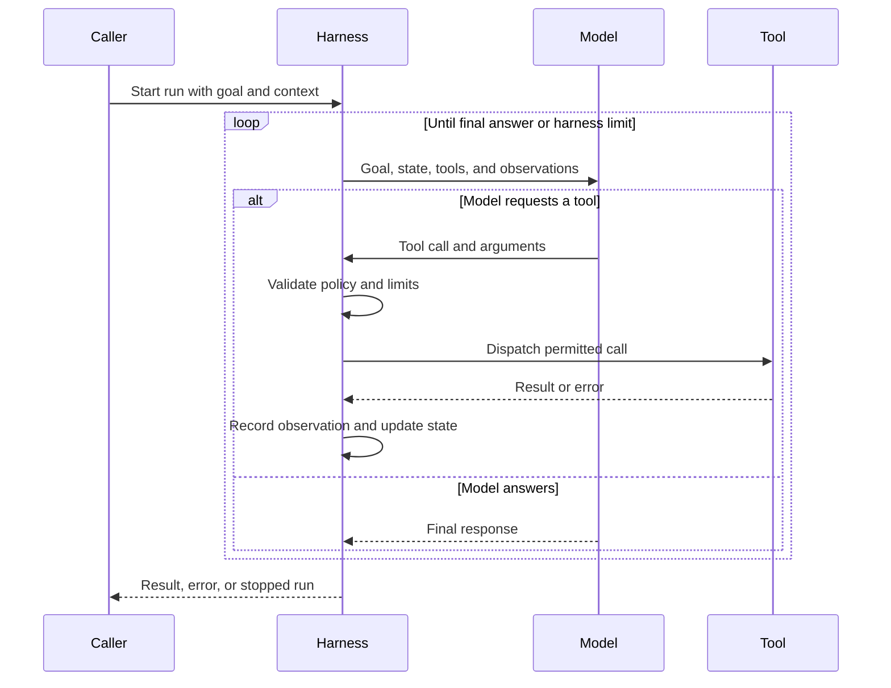
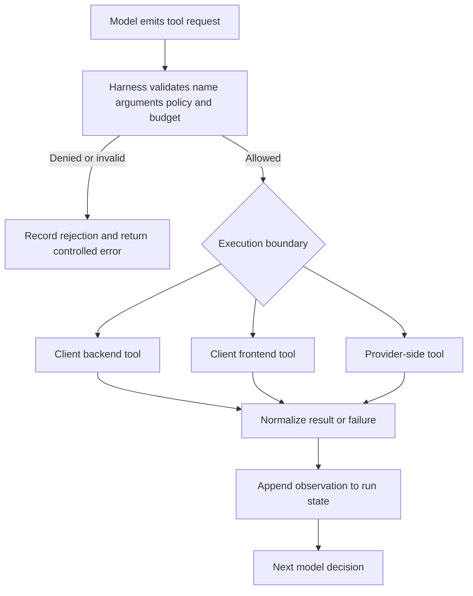
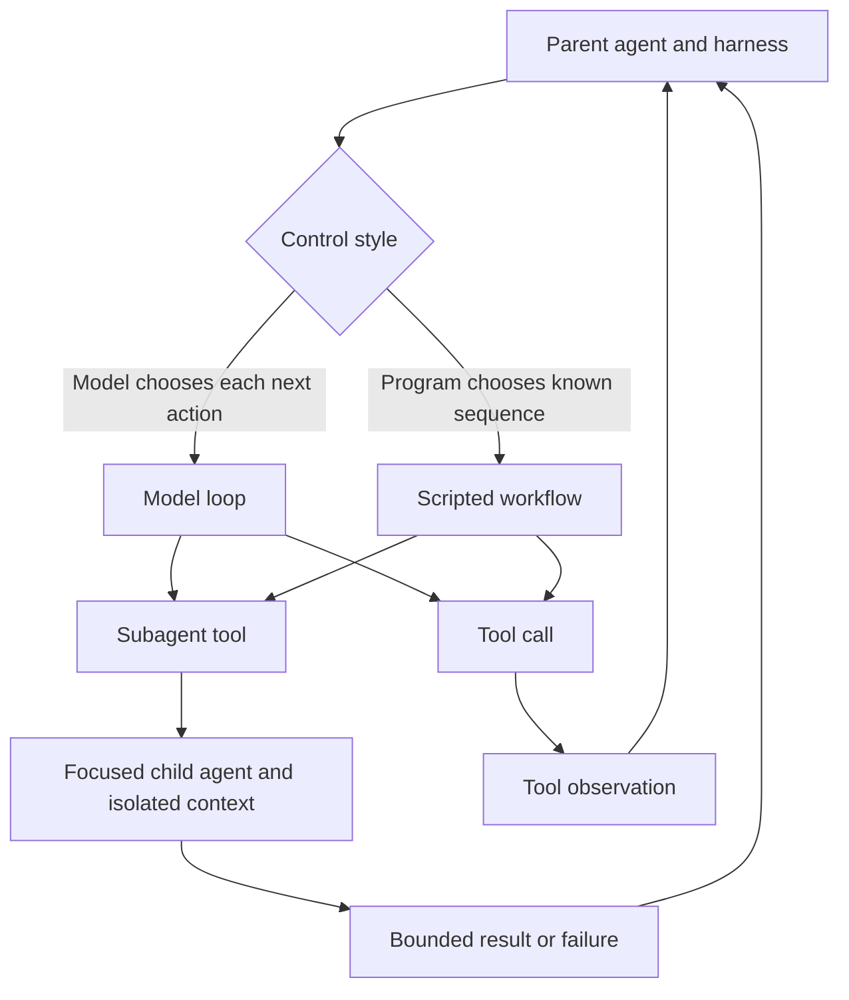

# Agent Systems Architecture

An **agent architecture** is the behavioral pattern: a model chooses an action, uses a tool, observes the result, and continues toward a goal. An **agent harness** is the concrete runtime that makes that pattern executable. The distinction matters: the architecture describes who should decide and what must recur; the harness owns parsing, dispatch, state assembly, limits, isolation, and termination.

## The layers and their ownership

| Layer | Responsibility | Primary control decision |
| --- | --- | --- |
| Agent architecture | Defines the model-directed loop, planning, tool use, memory, and optional delegation | What action should happen next? |
| Model | Produces a response from the current goal and context, possibly containing a tool call | Which tool or final answer is appropriate? |
| Harness | Runs the loop, validates and dispatches calls, feeds observations back, manages state, and enforces policy | Is this call permitted, and should the run continue? |
| Tool | Performs a bounded operation against an environment or another capability | What effect or observation does this operation produce? |
| Memory and context | Carries working state between steps and optionally retrieves durable information | What information is available for the next decision? |
| Workflow or subagent | Encodes a repeatable procedure or delegates a bounded task | Should control remain scripted or be handed to another agent? |

The model is therefore not the whole agent. Tools provide action and new observations; the harness supplies the execution semantics around the model. See [Context and Knowledge](../concepts/context-and-knowledge.md), [Skills and Tooling](../concepts/skills-and-tooling.md), [Models and Protocols](../integrations/models-and-protocols.md), and [Security and Observability](../operations/security-and-observability.md) for adjacent concerns.

## Model loop

A run starts with a goal and an initial context. The harness builds the model request, including the available tool descriptions and current state. The model either returns a final response or proposes a tool call. For a call, the harness validates and dispatches the tool, records its result as an observation, updates working context, and invokes the model again. This repeats until the model finishes or the harness stops the run because a limit, policy, or failure condition is reached.

*The model-loop diagram shows the harness mediating every model request and tool effect.*

### State and lifecycle

The harness owns **run state**: the current messages or observations, pending work, step and retry counters, budgets, and termination status. The model does not persist state merely because it saw it; state must be carried in the next context assembled by the harness. Short-term memory lives in that working context. Durable memory is external and must be explicitly retrieved and written, so it introduces persistence, access-control, and poisoning considerations.

A useful lifecycle is:

1. **Initialize** the goal, model, tools, policy, limits, and initial context.
2. **Decide** by requesting the next model response.
3. **Act** by validating and dispatching a selected tool, or accept a final response.
4. **Observe** by recording the result or normalized error in state.
5. **Continue or stop** according to the model decision and harness rules.
6. **Finalize** with the answer, a failure, or an explicit limit/policy stop.

The invariant is that tool effects pass through the harness and their results become observable state before the next model decision. A malformed call, denied capability, tool failure, exhausted retry or step budget, and context-size failure are not model decisions; they are harness-level outcomes. A tool may be retried only when the harness policy says the operation is safe to retry—blind retries can duplicate side effects.

## Tool dispatch and execution boundaries

Tools are model-visible capabilities, not unrestricted model execution. A tool has an input contract and an execution location. Client-side tools run in the client backend or, for UI operations, in a frontend. Provider-side tools are defined and executed by the model provider; the client enables them through the provider API. Protocols such as MCP can expose tools across an integration boundary, but do not remove the need for authorization, validation, timeouts, and auditing.

*The tool-dispatch diagram separates capability selection from the boundary where execution occurs.*

The dispatch boundary is also the main security boundary. Sandboxing limits what a tool can read or change; authorization limits who may invoke it; budgets and timeouts limit resource consumption; observability records the requested capability, arguments as appropriate, outcome, and identity. Provider-side execution changes where enforcement and data handling occur, so provider configuration and protocol semantics must be reviewed separately from client controls.

## Subagents and workflows

A **subagent** is a separate agent instance assigned a focused task by a parent. It normally receives a bounded prompt, tools, authority, and context rather than the parent's whole working context. The parent harness (or a supervisor) owns delegation and incorporates the subagent's result. This keeps the parent context clean, but creates another trust boundary: delegated instructions, returned data, credentials, and tool authority must be constrained. Subagents are not peer agents; peers coordinate as independent principals, while a subagent receives task and authority from its parent.

A **workflow** is scripted or programmatic tool use. It is preferable when ordering, branching, retries, or fan-out are known in advance: it reduces model turns and token cost and is better suited to long-running procedures. A workflow can still call a model or spawn subagents, but its control flow is code-selected rather than re-decided by the model at every step. Executing model-written workflow code inside a harness expands the code-execution attack surface and requires a sandbox and explicit capability policy.

*The relationship diagram shows that both model loops and workflows may use tools or delegate, while the parent remains responsible for the result.*

## Extension and operational guidance

To extend an agent system, add capabilities at the narrowest boundary: a tool for one auditable operation, a workflow for deterministic orchestration, and a subagent for an independently scoped reasoning task. Keep model-facing schemas stable and descriptive, but enforce the real contract in the harness and tool implementation. Do not rely on prompts as the sole authorization mechanism.

Operationally, configure maximum steps, per-tool and total timeouts, retry policy, token or cost budgets, concurrency, sandbox permissions, and durable-state retention. Emit traces that connect a run to model calls, tool calls, delegated runs, and policy decisions without leaking secrets. Test the control points rather than only the happy-path answer: malformed arguments, denied tools, timeout and partial failure, retry idempotency, budget exhaustion, context growth, subagent isolation, workflow code restrictions, and provider-side tool behavior. These tests protect the architecture's key invariant—that the harness remains the authority over effects and termination—even when the model is wrong, unavailable, or adversarial.
