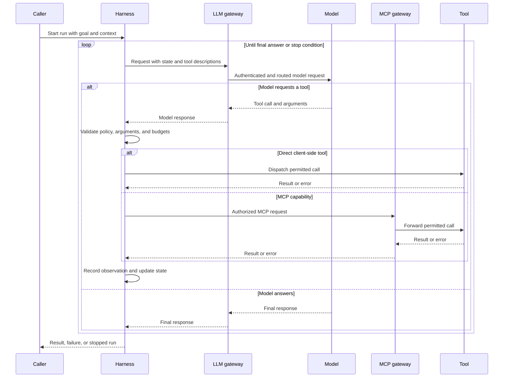
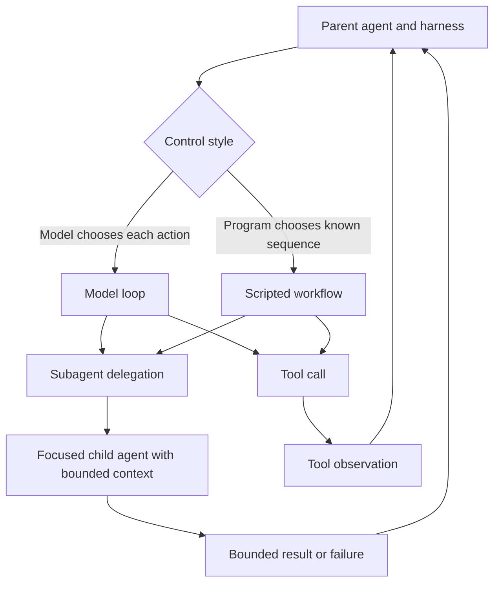

# Agent Systems Architecture

An **agent architecture** is the behavioral pattern: a model chooses an action, uses a tool, observes the result, and continues toward a goal. An **agent harness** is the concrete runtime that makes that pattern executable. The architecture describes what must recur; the harness owns parsing, dispatch, context assembly, state, limits, isolation, and termination. This page separates **source-note claims** (what the repository notes state) from **synthesized interpretation** (the ownership model that follows when those notes are composed).

## Source-note claims

The repository notes establish these boundaries:

- An agent is generally an LLM in a loop with tools; the model directs control flow, whereas a fixed flow is better represented as a workflow. See [Agent](../../wiki/ai-engineering/agents/agent.md), [Workflows](../../wiki/ai-engineering/harness/workflows.md), and [Agent Harness](../../wiki/ai-engineering/harness/harness.md).
- The harness parses model responses, dispatches tool calls, feeds results back, manages context and memory, enforces sandboxing and limits, and decides when to stop ([Agent Harness](../../wiki/ai-engineering/harness/harness.md)).
- Tools expose capabilities through provider APIs or protocols such as MCP. They may execute in a client backend, client frontend, or at the model provider ([Tools](../../wiki/ai-engineering/harness/tools.md)).
- MCP standardizes an LLM client's boundary to tools, resources, and prompts. Its current note describes an initialization handshake and persistent, bidirectional session, with scaling implications for remote deployments ([Model Context Protocol](../../wiki/ai-engineering/context/mcp.md)).
- An LLM gateway centralizes model-side authentication, authorization, rate limiting, routing/failover, content policy, and audit. An MCP gateway is the tool-side authenticated control point for permissions, secret injection, anonymization, guardrails, and audit ([LLM Gateway](../../wiki/ai-engineering/enterprise/llm-gateway.md), [MCP Gateway](../../wiki/ai-engineering/enterprise/mcp-gateway.md)).
- Subagents are separate, focused agent instances with their own context; authority and task come from a parent, unlike peer agents ([Subagents](../../wiki/ai-engineering/harness/subagents.md)). Workflows make tool calls programmatically for lower token use and long-running orchestration, but model-written workflow code introduces unexpected-code-execution risk ([Workflows](../../wiki/ai-engineering/harness/workflows.md)).

These notes are reference material rather than an implementation contract: individual deployments may place controls in different components, but should preserve the boundaries and qualifications above.

## Synthesized ownership model

| Layer | Responsibility | Primary control decision |
| --- | --- | --- |
| Agent architecture | Defines model-directed looping, planning, tool use, memory, and optional delegation | What action should happen next? |
| Model | Produces a response from the current goal and context, possibly containing a tool call | Which tool or final answer is proposed? |
| Harness | Runs the loop, validates and dispatches calls, assembles state, and enforces policy and limits | Is the proposal permitted, and should the run continue? |
| Tool | Performs a bounded operation against an environment or capability | What effect or observation does the operation produce? |
| Context and memory | Carries working state and optionally retrieves durable information | What information is available for the next decision? |
| Workflow or subagent | Encodes a repeatable procedure or delegates a bounded task | Should control remain scripted or be handed to another agent? |
| LLM gateway | Governs access and traffic between clients and models | Which model request is authenticated, routed, limited, and audited? |
| MCP gateway | Governs access between clients and MCP servers | Which external capability is discoverable and callable under which identity? |

The model is therefore not the whole agent. The harness is the authority immediately around the loop; gateways enforce cross-application and integration-boundary policy. A gateway can reject or transform traffic, but it does not replace the harness's responsibility to validate the model's proposal, track run state, or decide termination. See [Context and Knowledge](../concepts/context-and-knowledge.md), [Skills and Tooling](../concepts/skills-and-tooling.md), [Models and Protocols](../integrations/models-and-protocols.md), and [Security and Observability](../operations/security-and-observability.md) for adjacent concerns.

## Request and control flow

A run starts with a goal and initial context. The harness assembles the model request, including available tools and current state, and may pass through an LLM gateway. The model either returns a final response or proposes a tool call. For a call, the harness validates name, arguments, authority, and budget; it then dispatches to a client-side tool or an integration such as MCP, potentially through an MCP gateway. The harness records the result or normalized error as an observation and invokes the model again. The loop ends when the model finishes or a harness, gateway, provider, or tool failure prevents continuation.

*This sequence distinguishes harness control from the model gateway and the optional MCP tool gateway; direct client tools do not traverse the MCP gateway.*

## State and lifecycle

The harness owns **run state**: current messages or observations, pending work, step and retry counters, budgets, and termination status. A model does not persist state merely because it saw it; state must be carried in the next context assembled by the harness. Short-term memory lives in working context. Durable memory is external and must be explicitly retrieved and written, introducing persistence, access-control, and poisoning concerns.

A useful lifecycle is:

1. **Initialize** the goal, model, tools, gateways, policy, limits, and initial context.
2. **Decide** by requesting the next model response.
3. **Act** by validating and dispatching a selected tool, or accept a final response.
4. **Observe** by recording a result or normalized error in state.
5. **Continue or stop** according to the model decision and harness and gateway rules.
6. **Finalize** with an answer, failure, or explicit limit or policy stop.

The key invariant is that an effect passes through an authorized execution boundary and its result becomes observable state before the next model decision. A malformed call, denied capability, tool or provider failure, exhausted retry or step budget, and context-size failure are harness-level outcomes, not model decisions. Retry only when policy says the operation is safe to retry; blind retries can duplicate side effects. MCP's session lifecycle is a separate integration concern: its initialization and persistent connection state must be managed at the MCP boundary, not confused with the agent's run state.

## Tools and execution boundaries

Tools are model-visible capabilities, not unrestricted model execution. Each has an input contract, authority, and execution location:

- **Client-side backend tools** run on the client's backend and are the common case.
- **Client-side frontend tools** run in a frontend, typically for UI interactions.
- **Provider-side tools** are defined and executed by the model provider; the client enables them through the provider API.
- **MCP tools** cross a protocol boundary to an external server; an MCP gateway may multiplex servers and apply identity, permissions, secrets, anonymization, guardrails, and audit.

Protocols make capabilities discoverable and callable; they do not make them safe. Authorization, argument validation, timeouts, sandboxing, audit, and output handling remain necessary. Provider-side execution changes where enforcement and data handling occur, so provider configuration must be reviewed separately from client controls. Likewise, an MCP gateway is a central policy point, not a reason to omit per-run authorization or tool-level validation.

## Subagents and workflows

A **subagent** is a separate agent instance assigned a focused task by a parent. It normally receives a bounded prompt, tools, authority, and context rather than the parent's whole working context. The parent harness or supervisor owns delegation and incorporates the result. This keeps parent context clean, but creates a trust boundary: delegated instructions, returned data, credentials, and tool authority must be constrained. Subagents are not peer agents; peers coordinate as independent principals, while a subagent receives task and authority from its parent.

A **workflow** is scripted or programmatic tool use. It is preferable when ordering, branching, retries, or fan-out are known in advance: it reduces model turns and token cost and suits long-running procedures. A workflow can still call a model or spawn subagents, but its control flow is code-selected rather than re-decided by the model at every step. Running model-written workflow code inside a harness expands the code-execution attack surface and requires a sandbox and explicit capability policy.

*Both model loops and workflows may use tools or delegate, while the parent remains responsible for authority and the resulting state.*

## Safe extension and operations

Add capability at the narrowest boundary: a tool for one auditable operation, a workflow for deterministic orchestration, and a subagent for an independently scoped reasoning task. Keep model-facing schemas stable and descriptive, but enforce the real contract in the harness and tool implementation. Do not rely on prompts as the sole authorization mechanism. Use an LLM gateway for shared model access policy and an MCP gateway when many MCP servers need centralized identity, permissions, secrets, and audit; neither substitutes for least privilege in the calling run.

Configure maximum steps, per-tool and total timeouts, retry and idempotency policy, token or cost budgets, concurrency, sandbox permissions, durable-state retention, gateway rate limits, and MCP session behavior. Emit traces connecting a run to model requests, tool calls, delegated runs, gateway policy decisions, and outcomes without leaking secrets. Focus tests on control points rather than only happy-path answers: malformed arguments, denied tools, gateway rejection, timeout and partial failure, retry idempotency, budget exhaustion, context growth, MCP disconnect or stale session, subagent isolation, workflow code restrictions, and provider-side tool behavior. These tests protect the central architectural invariant: the harness remains the authority over effects and termination even when the model, provider, gateway, or tool is wrong, unavailable, or adversarial.
