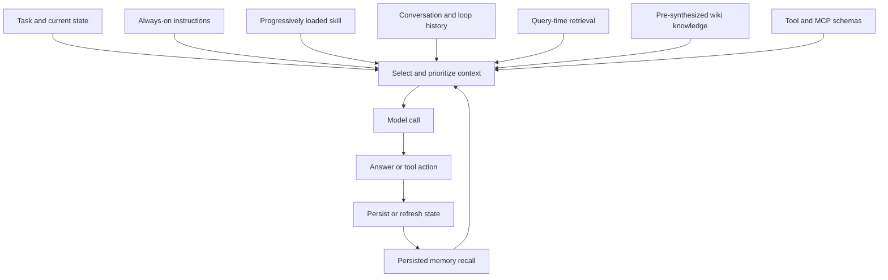

# Context, Memory, and Knowledge Retrieval

An agent's context is the evidence and control material presented to the model for one step. **Context engineering** is the deliberate selection, ordering, and budgeting of that material: instructions, tool definitions, conversation history, retrieved documents, memory, and task state. It is broader than prompt writing because it also decides what is available, when it is loaded, and which source is authoritative.

This page separates four easily conflated things:

- **Working context** is the finite input assembled for the current model call.
- **Memory** is state retained beyond a single call. It may be short-term working state carried across an agent loop or long-term state persisted externally and recalled later.
- **Retrieval** is the query-time act of selecting source material relevant to the current task. RAG commonly uses embeddings and semantic search, but retrieval can also use metadata, structured queries, keyword search, or application-specific indexes.
- **Knowledge** is curated, durable information intended to be reused. An OKF-style wiki is a human- and agent-readable representation of that knowledge, not a magical substitute for its underlying evidence.

## The assembly boundary

The model does not see an entire corpus or every installed capability. A harness assembles a bounded context for each step, typically combining always-on policy and instructions with selectively loaded skills, available tool schemas, recent history, recalled memory, and task-specific evidence. The result is an input, not a database: anything omitted cannot directly influence that call, and anything included consumes context budget.

*The diagram shows the context assembly boundary and the feedback paths that make memory and knowledge durable.*

Selection should optimize usefulness and trust, not merely maximize token count. Put stable constraints and task-relevant instructions where the harness will reliably retain them; load large references progressively; retrieve narrowly; and preserve source identity alongside extracted text. Summaries can reduce context cost, but compression is a transformation with loss and must not silently become the authority for a high-consequence decision.

## Two retrieval timings

### Pre-synthesized, durable knowledge

A durable wiki such as OpenWiki ingests configured sources into deterministic local snapshots and manifests, then runs source-specific synthesis to produce agent-oriented Markdown. The raw artifacts remain available for provenance checks. Later tasks can load a concise concept page rather than placing the full source corpus into every context. Scheduled ingestion can refresh the collection without making every agent call pay the indexing cost.

This is **pre-synthesis**: interpretation and organization happen before the task asks a question. It is especially useful for broad context, trends, commitments, cross-project continuity, and stable concepts. Its trade-off is freshness and interpretation risk. A generated page can be stale, omit an exception, or flatten an important qualification; links to evidence are useful leads, not proof that the linked page was fetched or revalidated during the current task.

The durable knowledge lifecycle is therefore:

1. Connectors capture source snapshots and manifests.
2. A synthesis run creates or updates concepts and records provenance where supported.
3. An agent loads relevant pages selectively as context.
4. For decisions affected by current implementation state, the agent verifies the page against primary evidence.
5. A later ingestion refreshes the derived page; it does not retroactively make old summaries authoritative.

### Query-time retrieval

RAG and related retrieval systems select material in response to the current query, then add the selected material to the model context. Embeddings and vector similarity are common, but they are not the definition of RAG. Retrieval pipelines also need normalization, chunking, metadata, access filtering, indexing, freshness handling, and a way to map a result back to its original source.

Query-time retrieval is preferable when the answer depends on rapidly changing or highly specific source material, when the corpus is too large to pre-summarize faithfully, or when access must be evaluated per request. It is not automatically more accurate: poor chunking, stale indexes, weak query formulation, or a missing structured-data path can produce plausible but irrelevant context. For structured or frequently changing data, a direct query or live tool may be safer than embedding a snapshot.

A useful hybrid is to use a wiki as the orientation layer—vocabulary, relationships, likely locations, and historical context—then use query-time retrieval or a live tool to verify the narrow claim. The wiki should help find the evidence, not erase the distinction between a derived summary and the source.

## Memory is state, not truth

Short-term memory carries the agent's working state across steps in one run; long-term memory persists facts, preferences, outcomes, or other state in an external store and retrieves it when relevant. A vector store is one implementation, not a requirement. Memory can be explicit structured records, documents, a relational store, or an event log.

Memory changes the agent's future behavior, so writes need ownership and policy: define what may be stored, who may read it, how it expires or is corrected, and whether a user or operator can inspect and delete it. Treat recalled memory as an input with provenance and confidence, not as an instruction. Untrusted or adversarial content can persist across turns as memory or context poisoning. High-impact actions should therefore re-check identity, authorization, and current primary evidence rather than trusting a remembered assertion.

## MCP resources and tools

[MCP](../architecture/agent-systems.md) is a JSON-RPC protocol boundary between an LLM application and external capabilities. Its tools let the model request an action; its resources expose retrievable external content; and its prompts provide reusable prompt material. MCP is not itself a memory system, vector database, or truth layer. A client decides how returned resource content enters context and how tool results are validated.

MCP sessions traditionally begin with an initialization handshake that negotiates protocol version and capabilities over a persistent connection. The server can also send progress, sampling, elicitation, and resource or tool-list-change notifications. This stateful model is natural for local stdio servers, but remote horizontal scaling must account for session state and connection affinity. An enterprise MCP gateway can centralize authentication, permissions, secret injection, anonymization, guardrails, and audit before requests reach many servers.

The important boundary is authority: a tool or resource may be live, but its output is still an observation from an external system. Apply the tool's access policy, retain enough provenance to reproduce the lookup, and do not allow retrieved text to override system or application policy merely because it contains imperative language.

## Authority and conflict resolution

Use an explicit evidence hierarchy rather than letting recency, fluency, or retrieval rank decide silently:

1. **Current primary evidence**—the relevant source file, database result, test result, API response, or operator-confirmed state—wins for concrete engineering and operational claims.
2. **Current, attributable derived evidence**—a generated page with source identity, generation time, and verification status—helps orient and can support broad claims, but should be checked when the detail matters.
3. **Unverified summaries, recalled memory, and model-generated explanations** are leads. They are useful for search terms and hypotheses, not sufficient evidence for consequential changes.

When sources disagree, preserve the disagreement, identify the freshness boundary, and fetch or inspect the higher-authority source. Do not imply that a URL was fetched merely because it is preserved as a reference. Generated summaries should remain explicitly qualified as leads; current primary evidence is more authoritative.

This also explains why durable knowledge and RAG are complementary rather than competing patterns. The wiki supplies a compact, reusable map; query-time retrieval and live tools supply task-specific detail; memory supplies continuity; and context engineering chooses what the model is allowed to rely on for this step.

## Operating and change guidance

- Keep source identity, generation time, freshness, and verification separate. Authorship of a summary is not verification of its claims.
- Scope retrieval by tenant, identity, and authorization before ranking or injecting content. Treat documents, memories, skills, tool results, and MCP resources as potentially untrusted input.
- Monitor context size, retrieval precision and recall, stale-page age, failed or empty retrievals, citation coverage, memory writes, and tool/resource errors. A successful model response is not evidence that retrieval was correct.
- Refresh embeddings or derived pages when source content changes; retain raw snapshots where provenance and regression investigation require them.
- Test the boundaries that matter: retrieval with ambiguous and current queries, stale-index behavior, access-filter enforcement, source-to-summary traceability, memory poisoning and deletion, MCP capability negotiation and disconnects, and fallback when no trustworthy evidence is found.
- Prefer a deterministic workflow or direct query when the required sources and control flow are known. Use an agent loop when adaptive selection and tool use add value, while keeping policy and authorization outside model discretion. See [Agent Systems](../architecture/agent-systems.md), [Knowledge Format and Visualization](knowledge-format-and-visualization.md), [Skills and Tooling](skills-and-tooling.md), and [Security and Observability](../operations/security-and-observability.md) for adjacent system boundaries.

## Further reading

- [Context engineering](https://docs.langchain.com/oss/python/deepagents/context-engineering)
- [Memory](https://docs.langchain.com/oss/python/deepagents/memory)
- [Model Context Protocol](https://modelcontextprotocol.io)
- [OpenWiki](https://github.com/langchain-ai/openwiki)
- [Open Knowledge Format](https://github.com/GoogleCloudPlatform/open-knowledge-format)
