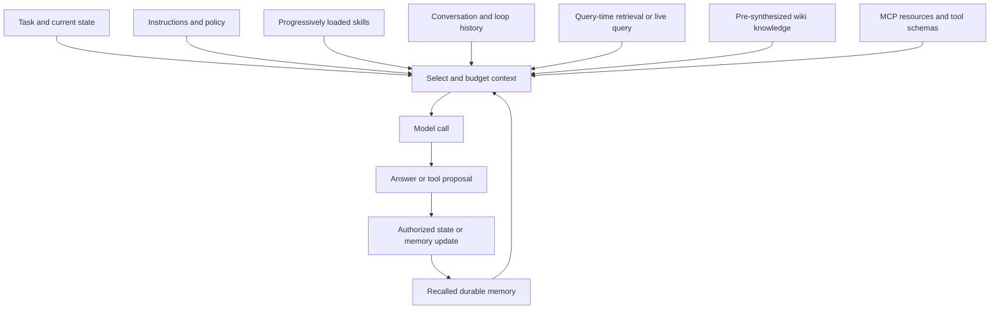

# Context, Memory, and Knowledge Retrieval

An agent's **working context** is the bounded evidence and control material presented to the model for one step. **Context engineering** deliberately selects, orders, compresses, and budgets that material: instructions, tool definitions, conversation history, task state, retrieved documents, memory, and capabilities. It is broader than prompt writing because it also determines what is available, when it is loaded, and which source is authoritative.

This page uses the following boundaries:

- **Working context** is the input assembled for the current model call. It is not a database; omitted information cannot directly influence that call.
- **Memory** is state retained beyond one call. Short-term memory is working state carried across steps; long-term memory is explicitly persisted and recalled across runs or sessions.
- **Retrieval** is selecting source material for the current task. RAG often uses embeddings and semantic search, but retrieval can also be keyword, metadata, structured, or application-specific.
- **MCP resources** are protocol-exposed retrievable content. MCP also exposes tools and prompts; it is a capability boundary, not automatically a memory store or truth layer.
- **Durable knowledge** is curated or synthesized information intended for reuse. An OpenWiki page is an orientation layer over evidence, not a substitute for that evidence.

## The assembly boundary

The harness assembles a context for each step from stable policy, selectively loaded skills, tool schemas, current state, recent history, recalled memory, and task-specific evidence. Skills commonly use progressive disclosure: names and descriptions stay cheap to discover, while the body loads on demand. Selection should optimize relevance and trust rather than token count: stable constraints must remain available, large references should load progressively, retrieval should be narrow, and source identity should travel with extracted text. Compression saves budget but introduces loss and must not silently become the authority for a high-consequence decision.

*The flow shows selection at the context boundary; persistence is an explicit feedback path, not an automatic property of model output.*

The harness remains responsible for validating model proposals, enforcing policy and budgets, dispatching tools, and carrying observations into the next context. A model does not persist state merely because it saw it. See [Agent Systems](../architecture/agent-systems.md) for the run lifecycle and execution boundaries.

## Durable knowledge versus query-time retrieval

### Pre-synthesized knowledge

OpenWiki's source note describes connectors writing deterministic raw snapshots and manifests, followed by source-specific synthesis into agent-oriented Markdown while raw artifacts remain available for provenance checks. A later task can load a concise concept page instead of the full corpus, and scheduled ingestion can refresh the collection without making every agent call pay the indexing cost.

This is **pre-synthesis**: interpretation and organization happen before a question is asked. It is useful for vocabulary, relationships, broad context, trends, commitments, and cross-project continuity. Its risks are freshness and interpretation: a page may summarize an old snapshot, omit an exception, or flatten a qualification. A link or citation is a lead unless the underlying evidence was actually inspected; it does not prove that an external page was fetched or independently verified.

A safe lifecycle is:

1. Capture configured sources into snapshots and manifests.
2. Synthesize or update concepts while preserving qualifications and provenance where supported.
3. Load relevant pages selectively as context.
4. Check current primary evidence when implementation, authorization, or operational details matter.
5. Refresh later; do not treat a new generation event as retroactive verification of old summaries.

### Query-time retrieval

RAG adds material selected in response to the current query. A useful pipeline must handle normalization, chunking, metadata, access filtering, indexing, freshness, and mapping results back to their original sources. Embeddings are one implementation, not the definition of retrieval.

Use query-time retrieval, a structured query, or a live tool when the answer depends on rapidly changing or highly specific data, the corpus is too large to summarize faithfully, or access must be evaluated per request. RAG is not automatically accurate: poor chunking, stale indexes, weak queries, and missing structured-data paths can produce plausible irrelevance. Frequently changing or structured data is often safer through a direct query or live tool than an embedded snapshot.

A strong hybrid is to use the wiki as an orientation map—terms, relationships, likely locations, and historical context—then retrieve or query the narrow evidence needed to verify the claim. Durable knowledge and RAG are complementary timings, not competing truth systems.

## Memory is state, not truth

Short-term memory carries working state across steps in one run. Long-term memory persists facts, preferences, outcomes, or other state externally and retrieves it when relevant. A vector store is optional: structured records, documents, relational stores, and event logs can all implement memory.

Because memory changes future behavior, its owner must define what may be written, who may read it, retention and correction rules, and whether users or operators can inspect and delete it. Treat recalled memory as an input with provenance and confidence, never as an instruction or proof. Untrusted content can persist as memory or context poisoning. High-impact actions must re-check identity, authorization, and current primary evidence rather than trusting remembered assertions.

## MCP resources, tools, and prompts

MCP is a JSON-RPC protocol boundary between an LLM application and external capabilities. Its **tools** let the model request an action, **resources** expose retrievable external content, and **prompts** provide reusable prompt material. The client decides how returned resource content enters context and how tool results are validated; MCP itself does not decide whether content is true or durable.

The repository's MCP note describes a stateful session beginning with an initialization handshake that negotiates protocol version and capabilities over a persistent, bidirectional connection. Servers may send progress, sampling, elicitation, and resource or tool-list-change notifications. This fits local stdio servers naturally, while remote horizontal scaling must account for session state and connection affinity. The note records a future-facing stateless redesign as a dated external status, not as independently verified current behavior; deployments should check the applicable protocol revision.

An MCP gateway can centralize authentication, permissions, secret injection, anonymization, guardrails, and audit before requests reach many servers. That does not make returned content authoritative. Apply access policy, preserve lookup provenance, validate tool arguments and outputs, and reject retrieved imperative text that conflicts with system or application policy.

## Authority and conflict resolution

Use an explicit hierarchy instead of allowing recency, fluency, or retrieval rank to decide silently:

1. **Current primary evidence**—the relevant source file, database result, test result, API response, or operator-confirmed state—wins for concrete engineering and operational claims.
2. **Current, attributable derived evidence**—a generated page with source identity, observation or generation time, and verification status—helps orient and may support broad claims, but should be checked when detail matters.
3. **Unverified summaries, recalled memory, and model-generated explanations** are leads for search terms and hypotheses, not sufficient evidence for consequential changes.

When sources disagree, preserve the disagreement, identify the freshness and authority boundary, and inspect the higher-authority source. Keep authorship, freshness, generation, and verification separate. A `Resources` link is navigation, not proof of a fetch; a recent generated page is not necessarily based on a recent observation. See [Knowledge Maintenance and Provenance](../operations/maintenance-and-provenance.md) and [Knowledge Format and Visualization](knowledge-format-and-visualization.md).

## Choosing safely

| Need | Prefer | Why and caution |
| --- | --- | --- |
| Stable constraints or capability descriptions | Working context and progressively loaded skills | Always available when required, but consumes budget; enforce policy outside the model. |
| Continuity across steps | Short-term working state | Exact observations remain in the run; bound growth and normalize errors. |
| Cross-session preferences or outcomes | Governed long-term memory | Enables continuity; requires retention, access control, correction, deletion, and poisoning defenses. |
| Broad orientation and durable relationships | Curated or synthesized wiki knowledge | Compact and reusable; may be stale or interpretive, so follow provenance. |
| Narrow, current, access-sensitive facts | Query-time retrieval, structured query, or live tool | Fresh and request-scoped; still validate results and retain source identity. |
| External content or actions behind a protocol | MCP resources or tools | Integrates capabilities; session, authorization, output-validation, and gateway behavior remain operational concerns. |

## Operations and focused tests

- Scope retrieval and memory recall by tenant, identity, and authorization before ranking or injection. Treat documents, memories, skills, tool results, and MCP resources as untrusted input.
- Monitor context size, retrieval precision and recall, stale-page age, empty retrievals, citation or provenance coverage, memory writes, and tool/resource errors. A successful model response does not prove retrieval correctness.
- Refresh indexes and derived pages when source content changes; retain snapshots and manifests when reproduction, audit, or regression investigation requires them.
- Test ambiguous and current queries, stale indexes, access-filter enforcement, source-to-summary traceability, memory poisoning and deletion, MCP negotiation and disconnects, tool failures, and no-trustworthy-evidence fallbacks.
- Prefer deterministic workflows or direct queries when sources and control flow are known. Use an agent loop when adaptive selection adds value, while keeping authorization and policy outside model discretion.

Adjacent boundaries are documented in [Skills and Tooling](skills-and-tooling.md) and [Agent Systems](../architecture/agent-systems.md). For source-note qualifications and historical evidence, retain the distinctions described in [Knowledge Maintenance and Provenance](../operations/maintenance-and-provenance.md); external references in the seed notes were not independently fetched for this page.

## Further reading

- [Context engineering](../../wiki/ai-engineering/context/context-engineering.md)
- [Memory](../../wiki/ai-engineering/context/memory.md)
- [Model Context Protocol](../../wiki/ai-engineering/context/mcp.md)
- [OpenWiki](../../wiki/ai-engineering/context/openwiki.md)
- [RAG](../../wiki/ai-engineering/context/rag.md)
- [Open Knowledge Format](../../wiki/ai-engineering/context/okf.md)
