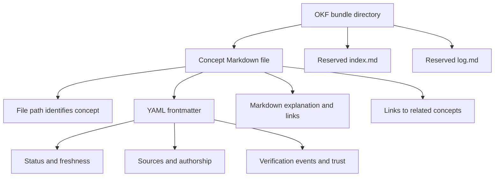
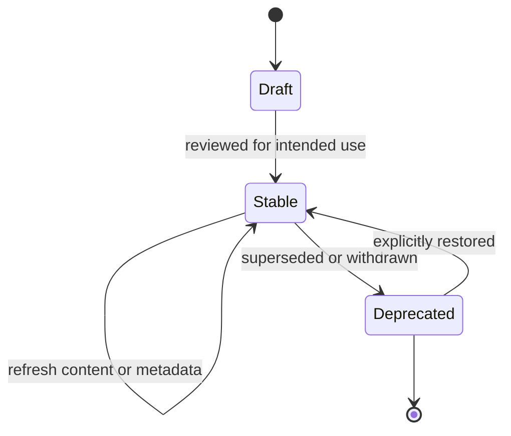

# Open Knowledge Format and Visualization

[Open Knowledge Format (OKF)](https://github.com/GoogleCloudPlatform/open-knowledge-format) is a vendor-neutral convention for agent-readable knowledge: a directory of Markdown files with YAML frontmatter. The durable unit is a **concept**. One concept occupies one file, and the file path is its identity; there is no required schema registry, central authority, or mandatory toolchain. An OKF bundle can therefore be authored, reviewed, linked, and consumed with ordinary filesystem and Markdown tooling.

This page describes the format and the two relevant viewing paths. It preserves the distinction between the local bundle renderer and Google's upstream reference consumer: a viewer is optional tooling, not part of OKF's interoperability contract.

## Concept files and bundle structure

A concept file starts with OKF frontmatter and then contains human- and agent-readable Markdown. `type` is the only always-required core field. Concepts may link to other concepts, while reserved `index.md` and `log.md` files serve bundle-level navigation and history rather than ordinary concepts.

A useful mental model is:



*The bundle model separates concept identity and content from bundle-level navigation and history.*

The format is deliberately permissive. A consumer can read the Markdown body without understanding every newer metadata field, and a bundle can remain useful without a viewer. Conversely, a renderer should not be treated as the authority for what constitutes a valid concept: its parsing and navigation choices are implementation behavior.

## v0.1 pin versus upstream v0.2

The following distinction is operationally important. On **2026-09-30**, the upstream specification was checked as **v0.2**, while the local OKF skill reference was a **v0.1** snapshot captured on **2026-07-04**, and the local index generator still declared `okf_version: "0.1"`. Existing bundles retain that declaration; this documentation is not a format migration.

The core model remains compatible: Markdown concepts, `type`, reserved files, cross-links, and permissive consumption. v0.2 makes provenance and trust machine-readable:

| Concern | v0.2 convention | Operational meaning |
| --- | --- | --- |
| Provenance | `sources` entries with required `resource` and optional stable `id` | Identifies evidence independently of display links |
| Authorship and freshness | `generated: { by, at }` and optional absolute `stale_after` | Says when and by whom content was generated; freshness is not verification |
| Verification | `verified` events | Separates machine or human checking from authorship |
| Lifecycle | `status: draft`, `stable`, or `deprecated`; absence means stable | Communicates intended consumption state |
| Computation | `Attested Computation` conventions | Describes executor, receipt, and deterministic attester information |

Two v0.2 changes are explicitly breaking at the field/convention level: `timestamp` is superseded by `generated.at`, and body `# Citations` lists are superseded by frontmatter `sources`. A v0.2 consumer can consume v0.1 documents using documented fallbacks, but a `# Resources` list remains a useful reading list and does not automatically become structured provenance.

Do not collapse these distinctions when maintaining a bundle. Generated authorship does not prove the claims; a source link does not prove that the source was fetched; and a verification event should not be invented merely to fill a field. A future migration should update the pinned reference, authoring skill, and index version together, migrate known provenance without fabricating verification, and test both renderers. Changing only a version constant would not make the current renderer display v0.2 trust fields.

## Lifecycle and maintenance boundaries

The practical lifecycle is:

1. Author or generate a concept with its stable path identity.
2. Add structured metadata when the consumer and pinned format support it, keeping source identity, authorship, freshness, and verification separate.
3. Link concepts using bundle-aware paths and maintain the reserved index and log deliberately.
4. Render a disposable view for navigation and reading; treat rendering as a projection, not a rewrite of canonical concepts.
5. Recheck primary evidence when a consequential decision depends on a derived page, and mark or refresh stale material rather than silently treating it as current.
6. Deprecate or replace concepts without changing the meaning of historical provenance and verification records.



*The lifecycle expresses the v0.2 status vocabulary; absence of `status` is treated as stable.*

The lifecycle state is not a trust score. `status: stable` does not mean that every assertion was human-reviewed, and `generated.at` does not mean the content is fresh forever. Consumers need the separate provenance, freshness, and verification signals to decide how much checking is required.

## Bundle navigation and visualizers

The local `okf_site.py` renderer is a custom graph-and-reader application. It provides an index landing page, change log, directory navigation, mobile Contents/Graph controls, title/description/type/tag search, and dynamically assigned type colors. It excludes `index.md` and `log.md` from the concept graph and renders them separately. It is the recommended normal browser for the current bundles.

Google's upstream `reference_agent visualize` command is a static HTML reference consumer. It embeds the bundle data and a browser-side graph, offers computed “Cited by” backlinks and selectable graph layouts, and displays v0.2 sources, authorship, verification, status, trust tier, and staleness. Both viewers use Cytoscape.js and marked.js, produce one HTML file, and need no backend after generation. CDN libraries are required unless vendored.

The important compatibility boundary is not the visual appearance but extraction behavior. The upstream documentation describes bundle-relative navigation, yet the current Python graph extractor skips targets beginning with `/`. In the dated **2026-09-30** comparison, running the unchanged upstream generator modules against both local bundles produced **zero graph edges**, and `log.md` was included as an `Unknown` node. Those are observed compatibility limits of that implementation, not limits of OKF itself. The local renderer's behavior must likewise not be presented as an upstream format guarantee.

| Capability | Local `okf_site.py` | Upstream `visualize` |
| --- | --- | --- |
| Basic view | Graph and reader with directory tree | Graph and detail panel |
| Navigation | Index, log, mobile Contents/Graph controls | Backlinks and selectable layouts |
| Search | Title, description, type, tags | Title, concept ID, tags |
| Types | Dynamic colors and clickable legend | Filters; fixed colors for three named types and gray for others |
| v0.2 metadata | Does not surface provenance, trust, or lifecycle fields | Displays sources, authorship, verification, status, trust, and staleness |
| Bundle-root graph links | Resolves `/concept.md` and relative links | Current extractor skips `/` targets |
| Reserved files | Separately renders index and log | Skips index but includes log as an Unknown concept |

Therefore the upstream viewer is **not a drop-in replacement today**. Keep the custom viewer for normal browsing. Upstream is useful to evaluate for backlinks, layouts, and metadata presentation, but losing the cross-link graph defeats its principal value for these bundles. A safe adoption sequence is to preview it alongside the custom output, then address bundle-root links, both reserved filenames, custom type distinction, mobile reading, and index/log access before considering replacement. Converting links in a disposable export can test extraction without changing canonical bundle identities.

## Running and verifying the upstream viewer

From a checkout of the upstream repository, the documented path is:

```bash
git clone https://github.com/GoogleCloudPlatform/open-knowledge-format.git
cd open-knowledge-format
python3 -m venv .venv
.venv/bin/pip install .
.venv/bin/python -m reference_agent visualize \
  --bundle /Users/dima/Projects/dima/.agents/skills/okf-ai-engineering/ai-engineering \
  --out /tmp/ai-engineering-viz.html \
  --name "AI Engineering"
.venv/bin/python -m reference_agent visualize \
  --bundle /Users/dima/Projects/dima/.agents/skills/okf-development/development \
  --out /tmp/development-viz.html \
  --name "Development"
```

The package requires Python >=3.11. Pin the upstream checkout to a reviewed commit for repeatability. The documented full CLI installation is heavier than the local renderer: it brings in Google ADK, BigQuery, Pydantic, and markdownify dependencies. Rendering existing Markdown does not invoke enrichment or require BigQuery/Gemini credentials, although the CLI eagerly imports agent dependencies.

**Verification boundary.** The comparison above ran the unchanged upstream viewer and document-parser modules with PyYAML in a temporary package layout. It did **not** install the full agent dependency tree or run the full CLI shown above. The commands were checked against the upstream README, package manifest, and CLI arguments. No renderer or build-task replacement was made. Repeat the full-CLI and browser checks, including mobile and reserved-file navigation, before changing the operational workflow.

## Related guidance and primary sources

- [Context, Memory, and Knowledge Retrieval](context-and-knowledge.md) explains why a generated concept is an orientation layer and why current primary evidence still matters.
- [Maintenance and Provenance](../operations/maintenance-and-provenance.md) covers refresh, provenance, and verification responsibilities.
- [Quickstart](../quickstart.md) provides the surrounding OpenWiki workflow.
- [OKF v0.2 specification and v0.1 changelog (§13)](https://github.com/GoogleCloudPlatform/open-knowledge-format/blob/main/SPEC.md)
- [Earlier specification location, also serving v0.2 when checked](https://github.com/GoogleCloudPlatform/knowledge-catalog/blob/main/okf/SPEC.md)
- [OKF tools directory](https://okf.md/tools/)
- [Tools directory: static visualizer](https://okf.md/tools/#2-static-html-visualizer-vizhtml)
- [Upstream README and commands](https://github.com/GoogleCloudPlatform/open-knowledge-format#visualize)
- [Generator: link extraction, reserved-file handling, type colors](https://github.com/GoogleCloudPlatform/open-knowledge-format/blob/main/src/reference_agent/viewer/generator.py)
- [Browser logic and metadata display](https://github.com/GoogleCloudPlatform/open-knowledge-format/blob/main/src/reference_agent/viewer/static/viz.js)
- [Package dependencies](https://github.com/GoogleCloudPlatform/open-knowledge-format/blob/main/pyproject.toml)
