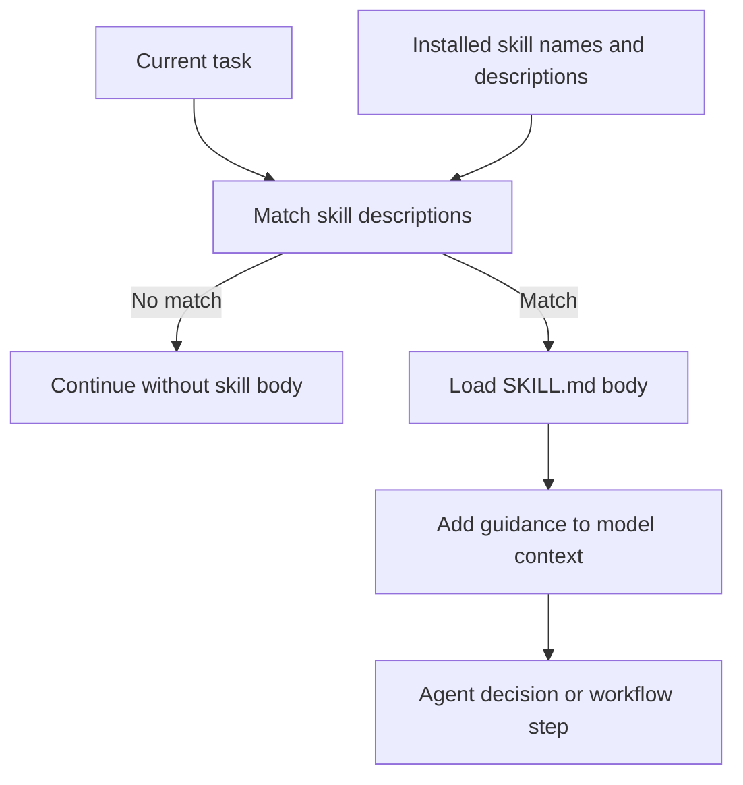
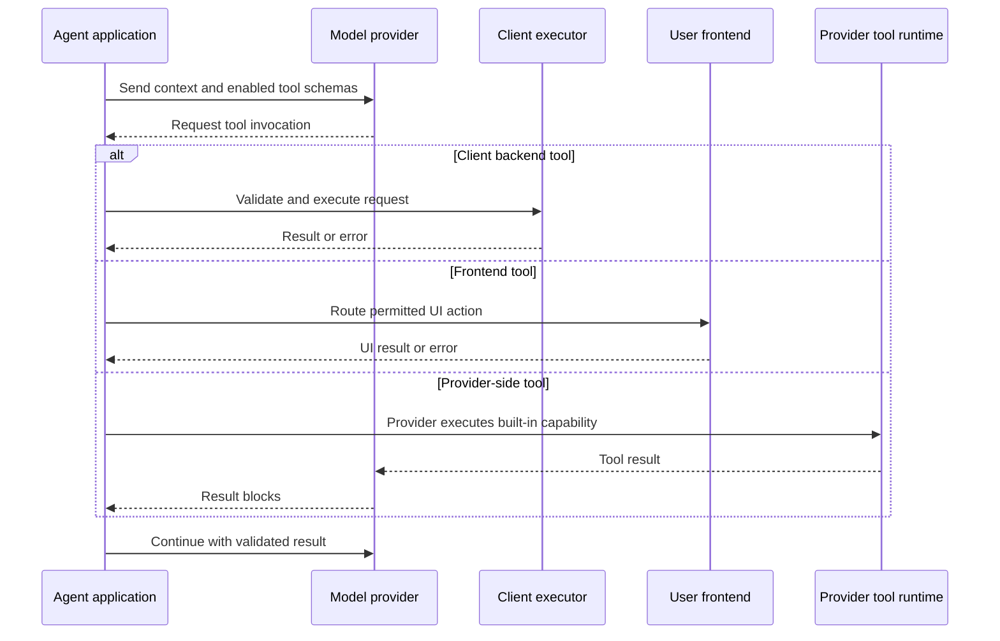

# Agent Skills and Tooling

Skills and tools extend an agent in different ways. A **skill** is a packaged body of knowledge or workflow guidance that a harness can load when a task matches its description. A **tool** is an invocable capability that lets the model read from or act on an environment. Skills primarily shape what the agent knows or how it approaches a decision; tools create an execution boundary and can change external state.

The distinction matters operationally: loading a skill spends context and depends on the agent recognizing the right entry point, while exposing a tool adds an available action and a control boundary to the agent loop. Neither should be treated as an automatic source of truth or authorization.

## Skills use progressive disclosure

A typical skill is a directory containing `SKILL.md`. Its YAML frontmatter supplies a name and description; the body supplies the detailed instructions. The harness keeps the names and descriptions of installed skills available as an always-on index, then loads a matching body on demand. This two-tier arrangement makes the description a routing signal and the body the expensive, task-specific context.

*The flow shows that a skill body is loaded after description matching rather than placed in every model call.*

Skills have two materially different uses:

- **Knowledge supply** adds facts the model may not have, such as a private API shape, internal schema, or house style. This is most valuable for private or fast-changing knowledge. Repeating generally known practice has low value while still consuming context; for public documentation, live retrieval can be fresher than a vendored skill snapshot.
- **Behavior control** makes a known practice the default at a decision point, such as investigating before patching. This value does not disappear as models become more capable, but on-demand invocation is a weakness: the agent must recognize the moment when the skill should fire. A skill is therefore a workflow entry point, not a reliable always-on constraint.

Always-on requirements belong in project-scoped instruction files such as `AGENTS.md` or `CLAUDE.md`. Those files remain in context, can be tailored to the repository, and can explicitly say which skills to invoke. A generic third-party skill cannot reliably enforce its own invocation.

## Tool execution boundaries

Tools are the control primitive that lets an LLM interact with its environment, fetch context, perform actions, orchestrate workflows, or call subagents. They are exposed through provider APIs and protocols such as MCP. A harness normally presents a tool schema to the model, receives a requested invocation, routes it to the responsible executor, and returns the result for the next model step. The model can select an action, but application policy should decide whether that action is permitted.

Tools are usefully classified by where they run:

| Category | Definition | Typical responsibility |
| --- | --- | --- |
| Client-side backend | Executed by the client's backend | Database queries, application APIs, filesystem or workflow actions |
| Client-side frontend | Executed in the user's frontend | UI rendering, UI state access, and other interactive client behavior |
| Provider-side | Defined and executed by the model provider | Built-in web search, hosted file search, code execution, or image generation |

Frontend tools are newer and less standardized than backend tools. Provider-side tools differ from client tools at the ownership boundary: the client enables the capability in an API request and receives tool-use and result blocks, but does not host the implementation. Custom function calls and similar client-defined actions still require the client to execute the requested operation; they are not provider-side merely because a provider model requested them.

*The sequence distinguishes client-owned execution from provider-hosted execution and frontend routing.*

## Cost, scope, and lifecycle

Every installed skill has a listing cost because its description occupies context whether or not it is used. Loading the body adds a larger, task-specific context cost. Bulk installation amplifies the listing tax; duplicate discovery across harness directories can register the same skill twice; and plugins can bundle skills, hooks, and commands as an all-or-nothing unit. A plugin's `SessionStart` hook may inject instructions into every session outside the skill budget, creating a standing cost that can survive compaction.

Scope capabilities deliberately:

- Prefer a project-scoped skill when its knowledge or workflow is repository-specific.
- Install globally only capabilities genuinely shared across projects.
- Name individual skills rather than installing an entire repository or plugin when independent visibility matters.
- Track remote provenance and refresh sources rather than allowing an unexamined copy to drift.
- Review invocation counts: rarely used skills may be listing tax, while frequently needed rules may belong in project instructions instead.

Tool schemas also cost context, and a large tool surface increases selection ambiguity and the number of actions that must be guarded. Expose the smallest useful set for the task, keep tool names and descriptions precise, and separate read-only observation from state-changing operations. Tool results should retain enough source identity and status to be checked before they influence a consequential action.

## Trust and failure modes

Treat a third-party skill as a software dependency, not as documentation. Installed skills execute with the agent's permissions and may ship scripts. Review provenance, requested permissions, scripts, hooks, updates, and transitive dependencies before installation. The same caution applies to tool servers, plugins, retrieved skill text, and tool results: untrusted content must not override system or application policy.

Important failure modes include:

- **Missed invocation:** a skill's workflow is not loaded because matching or recognition fails. Put non-negotiable constraints in project-scoped instruction files and use explicit workflow entry points.
- **Stale knowledge:** a skill or provider index reflects an old API or policy. Prefer live retrieval for rapidly changing facts and preserve provenance for cached material.
- **Context overload:** descriptions, bodies, and tool schemas crowd out task evidence. Scope, summarize carefully, and load progressively.
- **Duplicate or conflicting guidance:** skills discovered from multiple directories or a plugin and direct installation can drift or register twice. Keep one owned copy and audit discovery paths.
- **Unsafe execution:** a model request is not authorization. Validate identity, tenant, arguments, permissions, side effects, and approval requirements at the application or tool boundary; log the decision and result.
- **Provider/client confusion:** a provider-hosted result may look like a local action, while a custom function call still depends on client execution. Make ownership and failure handling explicit.
- **Untrusted output:** tool results and skill content can contain prompt injection or misleading instructions. Treat them as observations, validate them, and do not let them change policy.

A practical control flow is: select the narrowest relevant skills and tools, assemble their schemas and guidance with current task context, let the model propose a tool call, enforce authorization outside the model, execute in the owning runtime, validate the result, and only then continue the loop. For high-impact or irreversible actions, require explicit approval or deterministic application logic rather than relying on a skill's prose.

## Design and test checklist

When adding a skill, document whether it supplies knowledge or controls behavior, its invocation signal, project/global scope, provenance, scripts, and expected context cost. When adding a tool, document its owner, input and output contract, side effects, credentials, timeout and failure behavior, audit fields, and whether it is backend, frontend, or provider-side.

Focused tests should exercise the boundaries rather than merely confirm that a file exists:

- description matching, progressive body loading, duplicate discovery, plugin/session-start injection, and context-budget behavior;
- skill behavior when the task does not match, when the knowledge is stale, and when instructions conflict with project policy;
- tool-schema selection, malformed and adversarial arguments, authorization denial, timeouts, retries, partial results, and idempotency for repeated calls;
- frontend routing and disconnected clients, provider-tool result handling, and the distinction between provider execution and client function execution;
- provenance and audit records, prompt-injection resistance in skill content and tool results, secret non-disclosure, and approval gates for state-changing actions.

For the broader context assembly model, see [Context, Memory, and Knowledge Retrieval](context-and-knowledge.md). For the surrounding agent architecture, see [Agent Systems](../architecture/agent-systems.md).
