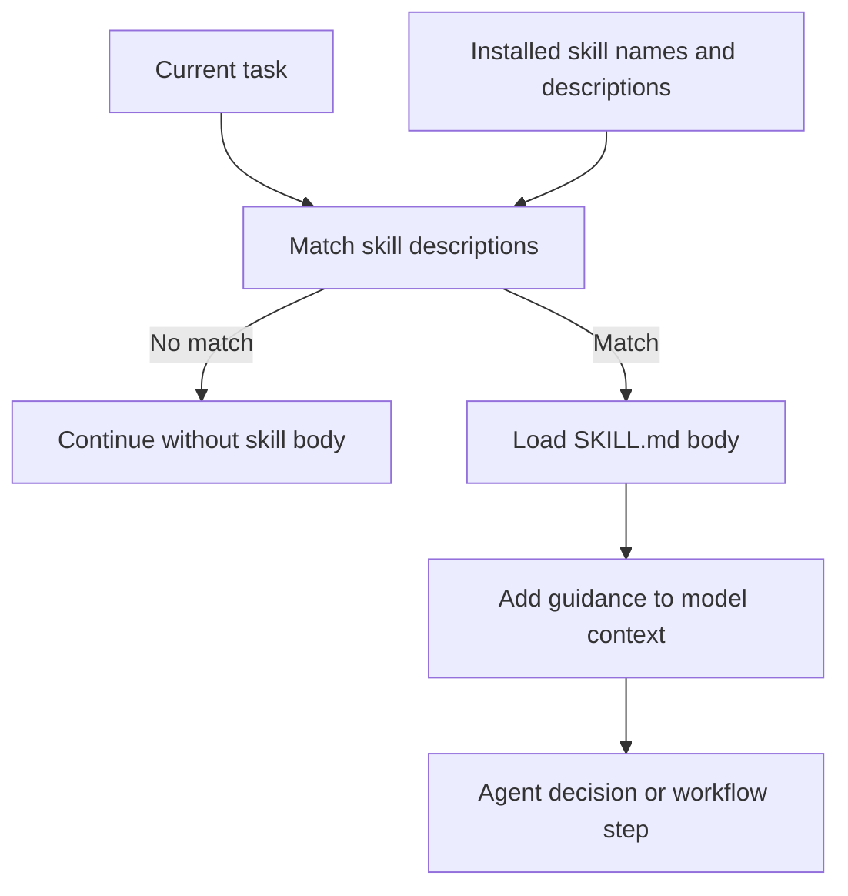
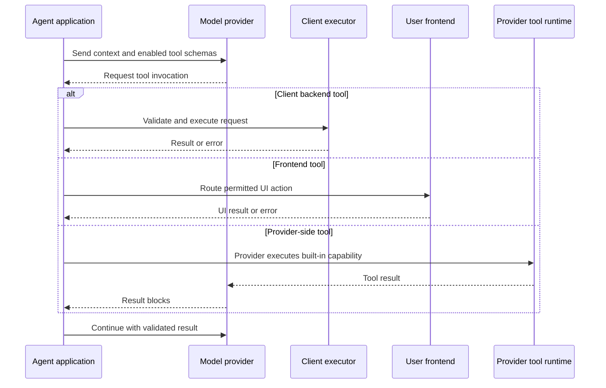
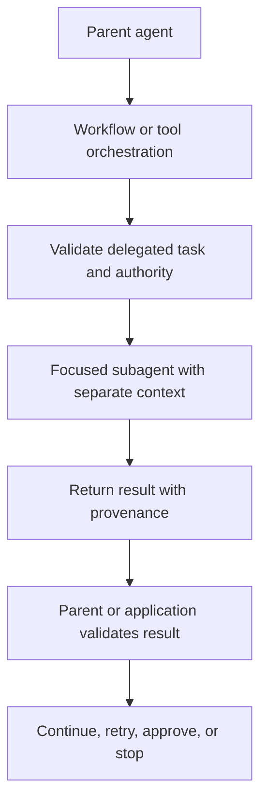

# Agent Skills and Tooling

Skills, tools, workflows, and subagents extend an agent at different boundaries. A **skill** is a packaged body of knowledge or workflow guidance that a harness can load when a task matches its description. A **tool** is an invocable capability that lets the model read from or act on an environment. A **workflow** scripts or orchestrates tool calls inside the harness. A **subagent** is a separate agent instance delegated a focused task by a parent. Skills primarily shape knowledge and decisions; tools create execution boundaries; workflows trade interactive model turns for programmatic orchestration; and subagents trade a larger system surface for isolated task context.

The distinction is operational, not merely terminological. Loading a skill or exposing a tool changes the model's available context or actions, while the harness owns dispatch, context management, limits, sandboxing, and stopping. A model proposal is not authorization: application policy must decide whether a call, workflow step, or delegation is permitted.

## Skills use progressive disclosure

A typical skill is a directory containing `SKILL.md`. Its YAML frontmatter supplies `name` and `description`; the body supplies detailed instructions. The harness keeps installed skill names and descriptions available as an always-on index, then loads a matching body on demand. Descriptions are therefore routing metadata and the body is the expensive, task-specific context.

*The flow shows that a skill body is loaded after description matching rather than placed in every model call.*

Skills have two materially different uses:

- **Knowledge supply** adds facts the model may not have, such as a private API shape, internal schema, or house style. This is valuable for private or fast-changing knowledge, but vendored public documentation can silently become stale; live retrieval via MCP may be fresher. Repeating generally known practice still consumes context.
- **Behavior control** makes a known practice the default at a decision point, such as investigating before patching or designing before implementing. A skill is an entry point to a workflow, not a reliable always-on constraint, because it fires only when matching and agent recognition succeed.

Always-on requirements belong in project-scoped instruction files such as `AGENTS.md` or `CLAUDE.md`. They remain in context, can be tailored to the repository, and can explicitly say which skills to invoke. A generic third-party skill cannot reliably enforce its own invocation.

## Tool ownership and invocation

Tools let an LLM interact with its environment, fetch context, perform actions, orchestrate workflows, or call subagents. They are exposed through provider APIs and protocols such as MCP. The harness normally presents a schema, receives a requested invocation, validates and routes it to the responsible executor, returns a result or error to the model, and continues the loop. The owning application or runtime—not the model—must enforce authorization, credentials, side-effect policy, timeouts, and limits.

Tools are classified by where they run:

| Category | Execution owner | Typical responsibility |
| --- | --- | --- |
| Client-side backend | Client's backend | Database queries, application APIs, filesystem, and workflow actions |
| Client-side frontend | User's frontend | UI rendering, UI state access, and interactive client behavior |
| Provider-side | Model provider | Built-in web search, hosted file search, code execution, or image generation |

Frontend tools are newer and less standardized than backend tools; examples include Google's A2UI, LangChain headless tools, and FastMCP MCP apps. Provider-side tools differ at the ownership boundary: the client enables a provider capability in an API request and receives tool-use/result blocks, but does not host the implementation. A custom function call—and provider features such as Computer Use that require client execution—remain client-owned even when the provider model requested them.

*The sequence distinguishes client-owned execution from provider-hosted execution and frontend routing.*

## Workflows and subagents

A workflow is scripted tool use inside the harness. It can reduce token usage and coordinate long-running or repeatable tasks by making calls programmatically rather than asking the model to narrate every step. A workflow can also invoke a subagent-spawning tool, making delegation composable. That efficiency does not remove risk: model-written workflow code executes inside the harness and can introduce unexpected code execution or bypass assumptions made for a single interactive call.

A subagent is a separate agent instance with its own context, delegated a focused task by a parent. The separation keeps the parent's context cleaner and can support parallel or specialized work, but the parent supplies the task and authority; this is not the same trust relationship as peer agents. Results and instructions crossing the boundary require explicit contracts, provenance, validation, and least authority. Multi-agent coordination consequently adds an inter-agent communication attack surface.

*The delegation flow separates context ownership from authority and makes result validation an explicit boundary.*

## Cost, scope, and lifecycle

Every installed skill has a listing cost because its description occupies context whether or not it is used; loading the body adds a larger task-specific cost. Bulk installation amplifies the listing tax, duplicate discovery can register the same skill twice, and plugins can bundle skills, hooks, and commands as an all-or-nothing unit. A plugin `SessionStart` hook may inject instructions into every session outside the skill budget, creating a standing cost that can survive compaction. Tool schemas also consume context and a large surface increases selection ambiguity.

Scope capabilities deliberately:

- Prefer a project-scoped skill when its knowledge or workflow is repository-specific; install globally only genuinely shared capabilities.
- Name individual skills rather than installing an entire repository or plugin when independent visibility matters.
- Move non-negotiable behavior into project instructions, and audit invocation counts: rarely used skills may be listing tax while frequently needed rules may belong there instead.
- Expose the smallest useful tool set, keep names and descriptions precise, and separate read-only observation from state-changing operations.
- Treat workflows and subagents as lifecycle-bearing resources: define budgets, cancellation, retries, timeouts, result size, and whether repeated calls are idempotent.
- Track remote provenance and refresh sources rather than allowing an unexamined skill, tool server, or subagent prompt to drift.

## Trust and failure modes

Treat a third-party skill as a software dependency, not documentation. Installed skills execute with the agent's permissions and may ship scripts. Review provenance, requested permissions, scripts, hooks, updates, and transitive dependencies before installation. Apply the same caution to tool servers, plugins, retrieved skill text, subagent instructions, and tool results: untrusted content must not override system or application policy.

Important failure modes include:

- **Missed invocation:** matching or recognition fails, so a workflow skill is not loaded. Put non-negotiable constraints in project instructions and use explicit entry points.
- **Stale or conflicting guidance:** a skill or provider index reflects an old API, duplicate discovery registers competing copies, or plugin and project instructions disagree. Preserve provenance and make policy precedence explicit.
- **Context overload:** descriptions, bodies, tool schemas, and parent/child messages crowd out task evidence. Scope and load progressively.
- **Unsafe execution:** a model request, workflow step, or child-agent result is not authorization. Validate identity, tenant, arguments, permissions, side effects, approval requirements, and audit fields at the owning boundary.
- **Ownership confusion:** provider-hosted results may look like local actions, while custom functions and some provider features still depend on client execution. Make timeout and failure handling explicit.
- **Untrusted output or delegation:** tool results, skill content, and child-agent messages can contain prompt injection or misleading instructions. Treat them as observations, validate them, and do not let them change policy.

A practical control flow is: select the narrowest relevant skills and tools, assemble schemas and guidance with current task context, let the model propose a call or delegation, enforce authorization outside the model, execute in the owning runtime, validate the result, and only then continue. For high-impact or irreversible actions, require explicit approval or deterministic application logic rather than relying on skill prose or a child agent's recommendation.

## Design and test checklist

When adding a skill, document whether it supplies knowledge or controls behavior, its invocation signal, project/global scope, provenance, scripts, and expected context cost. When adding a tool, document its owner, input/output contract, side effects, credentials, timeout and failure behavior, audit fields, and whether it is backend, frontend, or provider-side. For workflows and subagents, additionally document code execution boundaries, authority delegation, context/result contracts, cancellation, retry behavior, and approval gates.

Focused tests should exercise boundaries rather than merely confirm that a file exists:

- description matching, progressive body loading, duplicate discovery, plugin/session-start injection, and context-budget behavior;
- skill behavior when the task does not match, knowledge is stale, or instructions conflict with project policy;
- tool-schema selection, malformed and adversarial arguments, authorization denial, timeouts, retries, partial results, and idempotency for repeated calls;
- frontend routing and disconnected clients, provider-tool result handling, and the distinction between provider execution and client function execution;
- workflow cancellation, max steps, sandbox and permission enforcement, deterministic retry behavior, and unexpected code execution;
- subagent context isolation, authority limits, result validation, prompt-injection resistance across the delegation boundary, and insecure inter-agent communication;
- provenance and audit records, secret non-disclosure, and approval gates for state-changing actions.

The source bundle's primary references include [Claude Code Agent Skills](https://code.claude.com/docs/en/skills), [Anthropic's Agent Skills overview](https://www.anthropic.com/engineering/equipping-agents-for-the-real-world-with-agent-skills), [Claude Workflows](https://code.claude.com/docs/en/workflows), [LangChain Dynamic Subagents](https://docs.langchain.com/oss/python/deepagents/dynamic-subagents), [Anthropic server tools](https://platform.claude.com/docs/en/agents-and-tools/tool-use/server-tools), [OpenAI built-in tools](https://developers.openai.com/api/docs/guides/tools), and [Google Gemini built-in tools](https://ai.google.dev/gemini-api/docs/tools). Availability and execution semantics vary by provider, product, and model; provider documentation does not make client-defined function calls provider-hosted.

For the broader context assembly model, see [Context, Memory, and Knowledge Retrieval](context-and-knowledge.md). For the surrounding agent architecture, see [Agent Systems](../architecture/agent-systems.md).
