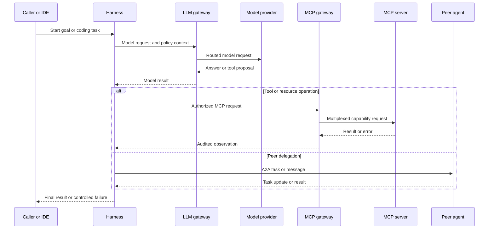
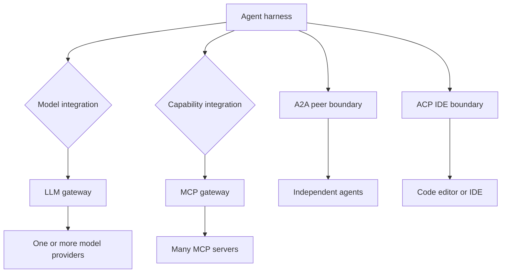

# Model Providers and Agent Protocols

An agent system is easier to reason about when four boundaries remain separate:

| Boundary | What it connects | Primary responsibility |
| --- | --- | --- |
| Model/provider integration | Harness and hosted or self-hosted model | Request/response API, model selection, token economics, caching, and provider-specific features |
| Agent-to-agent protocol | Independent agent applications | Delegated work, messages, tasks, and peer interoperability |
| Tool/resource protocol | An LLM client and external capabilities | Discovering and invoking tools, and reading resources or prompts |
| Enterprise gateway | Clients and many providers or capability servers | Authentication, authorization, routing, limits, policy, secrets, and audit |

The [agent systems architecture](../architecture/agent-systems.md) places the harness in the middle: it assembles context, calls a model, validates and dispatches effects, records observations, and decides when a run stops. A protocol can standardize an integration boundary, but it does not make the model the agent or remove the harness's authority over tools and termination.

## How the pieces connect

*This sequence shows gateways as control planes and protocols as distinct transport or interoperability boundaries around the harness.*

## Provider integration and model choice

A provider integration is the model-facing adapter. It must account for the provider's API shape, model capabilities, context limits, output semantics, rate limits, and billing—not just whether a model can produce text. Prompt caching is a concrete operational concern:

- **Claude:** caching is enabled with `cache_control`; matching is prefix-based, the default TTL is five minutes, and a successful hit refreshes that TTL. A one-hour TTL has a higher write rate. Anthropic documents separate ordinary-input, cache-creation, and cache-read usage.
- **GPT:** the documented GPT-5.6 pricing has a cliff when input exceeds 272,000 tokens: long-context rates apply to the entire request. Automatic and explicit cache breakpoints coexist, and a stable `prompt_cache_key` can improve matching. OpenAI guarantees at least 30 minutes of cache eligibility, so indefinite keep-alive pings should be treated as an experiment and verified through usage fields.
- **Gemini:** Gemini 2.5 and newer models support opportunistic implicit caching when the prompt meets the model's minimum size, while `generateContent` supports named explicit cache objects with configurable TTL. Gemini 3.1 Pro Preview has separate request-wide pricing tiers at 200K tokens; count tokens and inspect `usageMetadata` before expensive calls.

These are dated provider notes, not timeless price guarantees. Keep provider adapters and routing policy configurable, and log ordinary, cached, and cache-write tokens where the API exposes them. The LLM gateway is the natural place to compare provider cost, route or fail over, enforce rate and content policy, and centralize authentication and audit. Provider-side tools remain a provider execution boundary; enabling one does not turn it into an MCP server or a client-side tool.

## Evaluation: quality is not a protocol feature

Public leaderboards are useful for discovery, but no single leaderboard is simultaneously comprehensive, current, independent, methodologically consistent, and broad across reasoning, coding agents, tool use, long context, and real workflows. Use a broad dashboard to find candidates, then check the benchmark owner's results and run internal, task-specific evaluations.

Choose tests that reflect the intended harness behavior: repository software engineering, function calling, multi-step tool workflows, long-context retrieval, latency, cost, and end-to-end task success. Compare **cost per successful task**, not only price per token. Typed decision models can help with bounded routing or candidate selection, but typed output does not prove correctness; calibration, representative data, explicit fallback behavior, and escalation thresholds still matter.

[Jev](https://docs.typesafe.ai/) is described in the notes as a hosted System One decision primitive: it accepts state and scoped `Choice`, `Score`, or `Noul` questions and returns typed judgments. [CLM](https://github.com/Contrastive-LM/CLM) is a separately trained open-source alternative with a compatible decision API; it scores supplied candidates rather than inventing an arbitrary action. The reported CLM results use held-out tasks and candidate solutions generated by other models, so they are not evidence that CLM independently solves those full benchmarks. Treat both as model components selected and evaluated by the harness, not as replacements for protocol or gateway controls.

## Protocol roles

### A2A: peer-agent communication

Agent2Agent (A2A) is designed for communication between opaque, independent agentic applications—a REST-like boundary for agents. Its message and task data types address different interaction needs: a message can carry communication, while a task represents delegated work with progress or a result. A peer agent is not merely a tool: it can interpret an imprecise request and participate in problem solving. The harness remains responsible for deciding whether to delegate, what authority and context to disclose, how to authenticate the peer, and how to handle timeout, rejection, or partial results.

A2A is therefore appropriate for agent interoperability, not for exposing a local database or function to an LLM client. The source note also cautions that adoption has been more visible inside enterprise platforms than on the open internet; treat ecosystem support as an operational qualification rather than assuming universal reachability.

### ACP: IDE-to-coding-agent communication

Agent Client Protocol (ACP) standardizes communication between code editors or IDEs and coding agents. Its boundary is a client-development-tool integration, not general peer-agent federation. Use ACP when the initiating client is an IDE and the other participant is a coding agent; do not substitute it for A2A merely because both carry agent-related messages.

### MCP: tools, resources, and prompts

Model Context Protocol (MCP) is a JSON-RPC-based protocol between an LLM client and external capabilities. It standardizes tools and also supports resources and prompts. MCP was designed as stateful: initialization negotiates protocol version and capabilities over a persistent, bidirectional session, which permits server notifications and features such as sampling, elicitation, progress, and resource or tool-list changes. Local stdio servers fit this lifecycle naturally.

That statefulness complicates remote horizontal scaling: per-session state can require sticky sessions and makes serverless deployment harder. A proposed stateless-by-default redesign is recorded in SEP-1442 and SEP-2575; its target revision and merge date are dated source claims, so verify the current MCP specification before relying on them. MCP standardizes transport and capability semantics, not authorization: the harness or gateway must still validate arguments, enforce permissions, apply timeouts and budgets, and audit effects.

### Compatibility checklist

Choose the boundary from the participants, not from the fact that all four integrations may be called “agent protocols”:

| If the initiating participant is… | Use… | Do not infer… |
| --- | --- | --- |
| An IDE or code editor talking to a coding agent | ACP | Peer-agent federation or general tool discovery |
| An independent agent application delegating to another agent | A2A | That the peer is a local function, database, or trusted subagent |
| An LLM client consuming external tools, resources, or prompts | MCP | That discovery grants authorization or that the server is stateless |
| Many model or capability backends behind shared policy | An LLM or MCP gateway | That the gateway makes model context, cache, execution location, or session semantics interchangeable |

The concrete decision-model clients fit inside the harness rather than beside these protocols: a Jev request asks bounded typed questions about harness state, while CLM's documented service ranks supplied candidates through `POST /v1/rank` and exposes compatible `Choice`, `Score`, and `Noul` endpoints. Neither interface delegates effects or owns run termination. CLM is separately trained and its reported benchmark results are candidate-selection results, so compatibility with Jev's API should not be treated as equivalence of model behavior, calibration, or quality.

## Gateways and control flow

An **LLM gateway** fronts model providers. It centralizes authentication, authorization, rate limiting, routing and failover, content policy, and audit so applications do not each implement those controls. It is model-side control and may route the same harness to different providers, but it cannot make incompatible context windows, cache semantics, or tool execution locations identical.

An **MCP gateway** fronts many MCP servers. It presents an authenticated capability boundary while multiplexing servers and applying permissions, secret injection, anonymization, guardrails, and audit. It is tool-side control and should be treated as a high-value identity and privilege boundary. It does not replace an LLM gateway: one governs model access and provider routing; the other governs tool/resource access and server multiplexing.

*The harness can use several boundaries at once, while each gateway and protocol keeps its own role.*

## Operational guidance and focused tests

Configure provider routing, fallback eligibility, model-specific context budgets, cache policy, timeouts, retries, token and cost budgets, and data-handling policy at the gateway and harness boundaries. Keep stable prompt material first when using prefix caching, compact conversations before provider pricing cliffs, and record provider/model identifiers plus usage categories so a cost change is explainable.

Test the seams rather than only a successful answer:

- provider adapter request serialization, context-limit handling, usage accounting, cache hit and cold-write behavior, timeout, rate-limit, and failover semantics;
- evaluation fixtures for representative tasks, calibration, candidate coverage, cost per successful task, and explicit no-match escalation;
- MCP initialization, capability negotiation, session loss, notification handling, authorization, malformed arguments, timeout, duplicate or unsafe retry, and gateway audit records;
- A2A authentication, task progress, peer refusal, partial result, cancellation, context minimization, and delegated-authority limits;
- ACP IDE disconnects, agent capability negotiation, and safe propagation of coding-agent failures.

The key invariant is architectural: the provider may produce a decision, a protocol may carry a request, and a gateway may enforce cross-cutting policy, but the harness still owns the local run state, effect authorization, observation recording, and termination decision.

## Primary references

- [A2A protocol](https://a2a-protocol.org)
- [ACP](https://agentclientprotocol.com/)
- [MCP](https://modelcontextprotocol.io)
- [SEP-1442](https://github.com/modelcontextprotocol/modelcontextprotocol/issues/1442) and [SEP-2575](https://github.com/modelcontextprotocol/modelcontextprotocol/pull/2575)
- [Anthropic pricing and caching](https://docs.anthropic.com/en/docs/about-claude/pricing)
- [OpenAI pricing](https://developers.openai.com/api/docs/pricing)
- [Gemini pricing](https://ai.google.dev/gemini-api/docs/pricing)
- [LLM leaderboards and benchmark map](https://artificialanalysis.ai/)
