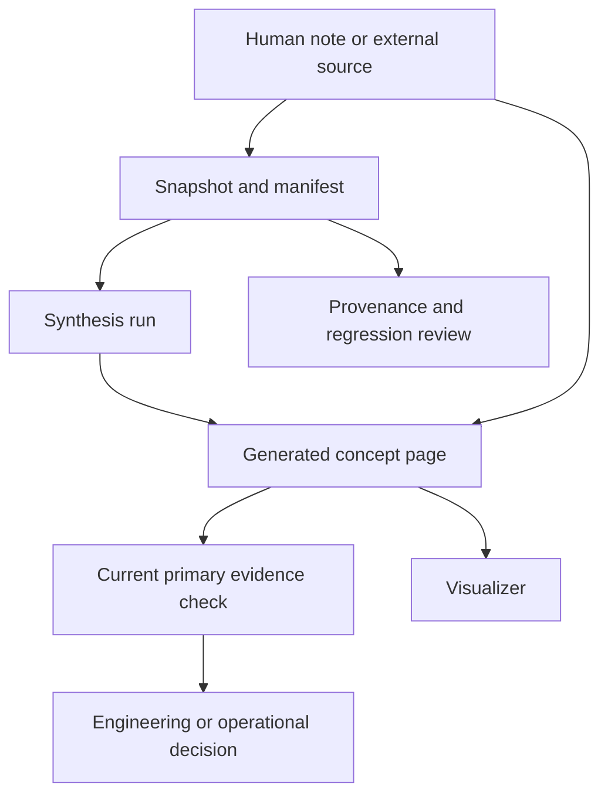
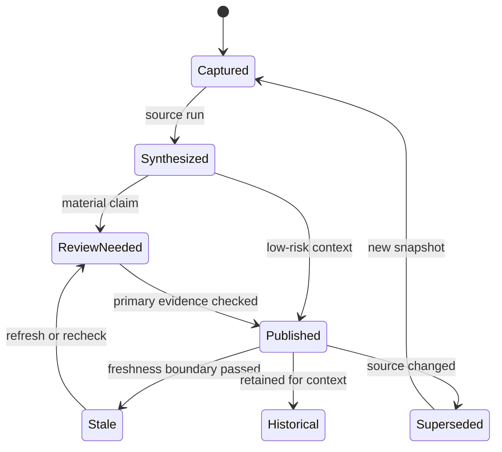

# Knowledge Maintenance and Provenance

OpenWiki knowledge has more than one authority boundary. Human-maintained notes under `wiki/` are source material; generated OpenWiki pages are derived context; source snapshots and manifests are evidence artifacts; and a visualizer is a consumer, not the knowledge itself. Maintenance is safe only when those layers remain distinguishable.

The most important rule is simple: **a generated summary is a useful map, not automatic proof of current behavior**. For a concrete implementation or operational decision, inspect the current primary evidence. Preserve the source URL, date, qualification, disagreement, and evidence gap when a note does not establish more than it says.

## Evidence layers and ownership

The repository's engineering instructions define `wiki/` as human-maintained source material and prohibit treating a local note as independently verified against its external links. The [Open Knowledge Format notes](../../wiki/ai-engineering/context/okf.md) describe the underlying model as one Markdown concept per file, with the file path serving as identity. OpenWiki's source note describes a pipeline in which connectors write deterministic raw snapshots and manifests, then source-specific runs synthesize those artifacts into pages while retaining the raw artifacts for provenance checks ([OpenWiki context](../../wiki/ai-engineering/context/openwiki.md)).

These are different responsibilities:

- **Curated note:** records a human judgment, its scope, source URL, date, qualifications, and unresolved disagreement. It is the input to maintenance, not a claim that the linked source was freshly fetched.
- **Snapshot and manifest:** preserve what an ingestion run actually observed and identify the input used for synthesis. Retain them when auditability, reproduction, or regression investigation matters.
- **Generated page:** organizes and summarizes source material for retrieval. Its generation time and verification state must not be confused with the age or authority of the underlying source.
- **Citation or provenance record:** connects a proposition to an attributable resource. A link in a `Resources` section is useful navigation, but it is not automatically structured provenance or proof of a fetch.
- **Visualizer:** renders a bundle for browsing. It should not silently change concept identity, links, reserved files, or metadata semantics.

The authority relationship is therefore:

*The flow separates captured evidence, derived knowledge, current verification, and visualization.*

A page may point to evidence, but the link alone does not establish that the evidence was fetched during the current task. If sources disagree, preserve the disagreement and state which observation is older, derived, or unverified rather than smoothing it into a single confident sentence.

## A maintenance lifecycle

Treat refresh as a controlled lifecycle rather than an overwrite:

1. **Capture:** ingest the configured source into a deterministic snapshot and manifest. Keep source identity and the capture time.
2. **Synthesize:** create or update the concept from the captured material. Preserve citations, qualifications, and explicit gaps; do not invent verification events.
3. **Review:** compare important claims with current primary evidence. A generated page can be a lead even when it is recent, and a human-authored note can be stale even when it is carefully cited.
4. **Publish:** expose the page only with its status, provenance, and freshness boundary clear to readers.
5. **Refresh or supersede:** rerun ingestion when source content changes, mark an observation stale when its freshness limit passes, or retain it as historical context when it explains a past decision.
6. **Audit:** retain the relevant snapshot, manifest, source URL, and reviewed version so a reader can reconstruct what the page meant at that time.

*The lifecycle distinguishes a current derived page from stale, superseded, and intentionally historical material.*

Do not delete historical context merely because current behavior changed. Label it as historical, include the observation date and reviewed version or commit where available, and add the current behavior separately. Conversely, do not let a historical tool invocation or bundle layout appear to describe today's OpenWiki workflow.

## Freshness, authorship, and verification

Freshness answers **when the input was observed**; authorship answers **who or what produced the derived page**; verification answers **whether a claim was checked and by whom**. They are independent. A newly generated page may summarize an old snapshot, and a human-reviewed statement may still have an explicit expiration because the system changes quickly.

When the format supports it, keep these concepts separate:

- `sources` identifies the resource behind a claim and may provide a stable identifier.
- `generated: { by, at }` identifies production of the document, not truth of every statement.
- `stale_after` expresses a freshness boundary, not an automatic invalidation mechanism.
- `verified` records a verification event separately from generation.
- `status` communicates lifecycle such as `draft`, `stable`, or `deprecated`; absence of a status has a defined default in the noted convention.

The [OKF note](../../wiki/ai-engineering/context/okf.md) records these as upstream v0.2 conventions, while the local reference and index were observed as a v0.1 snapshot on 2026-09-30. That dated observation is not a claim that every current OpenWiki bundle has migrated. Treat any version or field support as a compatibility question to verify in the relevant producer and consumer.

## Citations and source snapshots

For every material proposition, retain enough context for a later reader to answer:

- What resource supports it? Preserve the canonical URL or repository path.
- What was actually observed? Quote or summarize the relevant scope rather than citing an entire corpus without qualification.
- When was it observed? Use an observation or snapshot date, distinct from page generation time.
- Which version, commit, bundle, or configuration applied?
- What remains uncertain? Record failed fetches, partial inspection, disagreements, and assumptions.

A `Resources` list is not a substitute for claim-level provenance. The OKF notes specifically distinguish body reading links from structured `sources`; do not imply that an old `# Resources` link has populated machine-readable provenance. Likewise, do not manufacture a verification event merely because a source URL looks authoritative.

When refreshing a page, compare the new snapshot with the previous one before rewriting conclusions. If the source changed, either update the claim and retain the old observation as historical context, or explicitly retract the old conclusion. Keep the old snapshot when it is needed to explain a decision, diagnose a regression, or reproduce a generated artifact.

## Version pins and format migrations

Pin the version of any specification, parser, generator, or external checkout used to produce a reproducible artifact. Record the pin beside the command or configuration and explain its scope. A version pin answers “which behavior did this run use?”; it does not make that behavior current forever.

The dated OKF note identifies a meaningful migration boundary: upstream v0.2 superseded `timestamp` with `generated.at` and body `# Citations` lists with frontmatter `sources`, while documenting fallbacks for v0.1 documents. A safe migration must update the pinned reference, authoring guidance, and index version together, migrate known provenance without inventing verification, and test both renderers. Merely changing a version constant cannot make a renderer display fields it does not understand.

Before changing a format pin:

1. inventory producers, consumers, validators, and visualizers;
2. identify fields whose meaning or fallback changed;
3. preserve the old snapshot and record the migration date;
4. run representative old and new documents through every consumer;
5. inspect links, citations, freshness, status, and verification display;
6. publish the new behavior only after failures are explicit and recoverable.

## Visualizer compatibility

A visualizer is compatible only if it preserves the bundle's meaningful identity and navigation, not merely if it opens an HTML file. The dated [visualizer comparison](../../wiki/ai-engineering/context/okf-visualizers.md) describes a historical review of a local renderer and Google's upstream reference viewer. It explicitly says the upstream viewer is a reference consumer rather than a required part of OKF, and that its reproduced limits were based on bundles and source checked on 2026-09-30.

Use that note as a compatibility test plan, not as a statement of current OpenWiki behavior. In particular, test:

- bundle-root and relative links, including whether graph edges are retained;
- reserved `index` and `log` files and their intended presentation;
- custom concept types, legends, and filters;
- provenance, authorship, verification, status, and staleness fields;
- mobile reading and navigation controls;
- offline or CDN dependencies and the exact dependency versions;
- whether the tested CLI path was actually installed and run, rather than merely copied from documentation.

The comparison records that its full upstream CLI was not installed and that the inspected commands matched documentation; that is an evidence boundary worth preserving. Do not present its commands, dependency set, or compatibility findings as current OpenWiki behavior without a new run against a pinned checkout. If a disposable export changes links to test a renderer, keep canonical bundle identities unchanged and document the transformation.

## Operational checklist

Before publishing or refreshing a page:

- Identify whether each statement is curated source, captured observation, derived summary, or current verification.
- Preserve URLs, dates, version pins, qualifications, disagreements, and evidence gaps.
- Keep generation, freshness, authorship, verification, and lifecycle status separate.
- Recheck high-impact claims against current primary evidence.
- Retain snapshots and manifests needed to reproduce or explain the page.
- Test every consumer after a format or visualizer change; do not infer support from a changed constant.
- Mark old tooling and bundles as historical when their source context is dated.
- Prefer an explicit “not verified” or “not run” boundary over a plausible but unsupported compatibility claim.

For the broader distinction between durable knowledge, query-time retrieval, and current primary evidence, see [Context, Memory, and Knowledge Retrieval](../concepts/context-and-knowledge.md). For format and renderer relationships, see [Knowledge Format and Visualization](../concepts/knowledge-format-and-visualization.md).

## References

- [Open Knowledge Format](../../wiki/ai-engineering/context/okf.md)
- [OpenWiki context note](../../wiki/ai-engineering/context/openwiki.md)
- [OKF visualizer comparison](../../wiki/ai-engineering/context/okf-visualizers.md)
- [OpenWiki repository](https://github.com/langchain-ai/openwiki)
- [Open Knowledge Format specification](https://github.com/GoogleCloudPlatform/open-knowledge-format)
