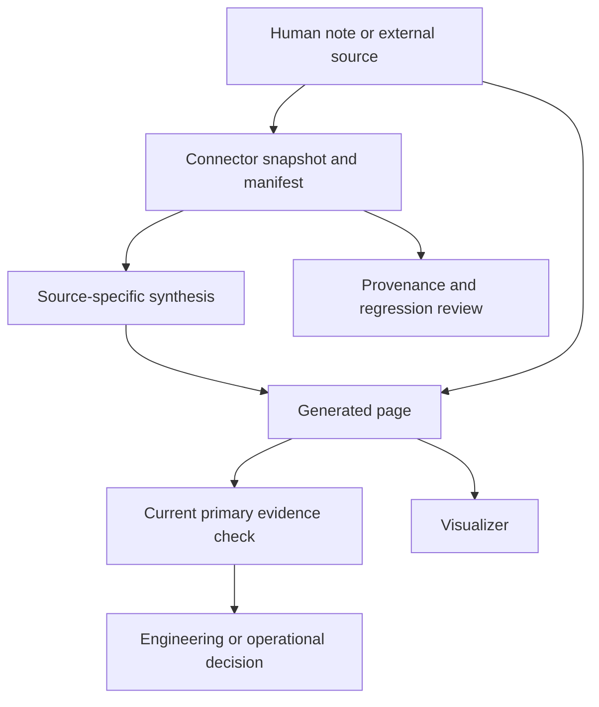
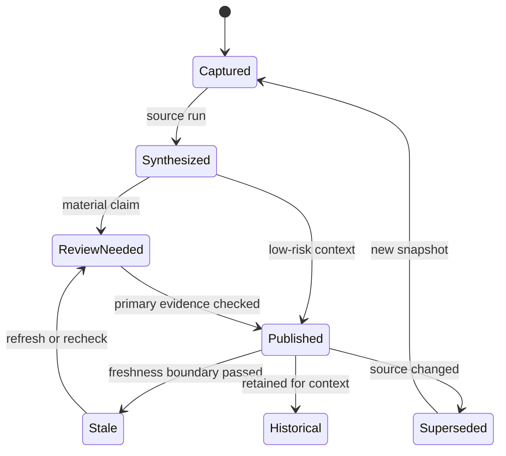

# Knowledge Maintenance and Provenance

OpenWiki knowledge has several authority boundaries. Human-maintained notes under `wiki/` are source material; connector snapshots and manifests are captured observations; generated pages are derived routing and context; and a visualizer is a consumer. Maintenance is safe only when those layers remain distinguishable.

The governing rule is: **a generated summary is a useful map, not automatic proof of current behavior**. For an implementation or operational decision, inspect current primary sources, tests, Git history, and runtime evidence. Preserve a source URL, date, qualification, disagreement, or evidence gap rather than turning an unverified note into a confident assertion. Links in the source notes were not thereby fetched or independently verified.

## Evidence layers and ownership

The [Open Knowledge Format notes](../../wiki/ai-engineering/context/okf.md) describe one Markdown concept per file, with the file path as identity. The [OpenWiki context note](../../wiki/ai-engineering/context/openwiki.md) describes connectors writing deterministic raw snapshots and manifests, followed by source-specific synthesis into pages while retaining raw artifacts for provenance checks. These source notes are human-maintained descriptions, not an independent observation of a current external system.

Use the layers for different jobs:

- **Curated source note:** records human judgment, scope, source URL, observation date, qualifications, and unresolved disagreement. It is input to maintenance, not proof that its external link was freshly fetched.
- **Snapshot:** records the source material actually captured by an ingestion run. Keep its identity, capture time, and relevant configuration together.
- **Manifest:** identifies the inputs and run context used for synthesis. It is the join point for reproducing a page or explaining why a page changed; it is not itself a verification of the source's truth.
- **Generated page:** provides derived routing and context for retrieval. It should help a reader find relevant evidence, not replace current primary sources, tests, Git history, or runtime checks.
- **Citation or provenance record:** connects a proposition to an attributable resource and, where supported, a stable identifier. A `Resources` link is navigation, not automatically structured provenance or proof of a fetch.
- **Visualizer:** renders a bundle for browsing. It must not silently change concept identity, links, reserved files, or metadata semantics.

The authority relationship is therefore:

*The flow separates captured evidence, derived routing context, current verification, and visualization.*

A page may point to evidence, but the link alone does not establish that the evidence was fetched during the current task. If sources disagree, preserve the disagreement and state which observation is older, derived, or unverified instead of smoothing it into one sentence.

## Connector-to-page lifecycle

Treat refresh as a controlled lifecycle rather than an overwrite:

1. **Configure and identify:** record the connector/source identity, scope, configuration, and version or commit of any parser or external checkout used.
2. **Capture:** ingest the configured source into a deterministic snapshot and manifest. Record what was observed and when; retain partial or failed results as an evidence boundary rather than silently presenting completeness.
3. **Synthesize:** run the source-specific synthesis against the captured inputs. Preserve citations, qualifications, source disagreements, and explicit gaps. Do not invent a fetch, verification event, or current-status claim.
4. **Review:** compare material claims with current primary source files, tests, Git history, and runtime evidence. A recent generation timestamp does not make an old snapshot current.
5. **Publish:** expose the generated page with its provenance, freshness boundary, and lifecycle status clear. Treat the page as derived routing/context for later retrieval.
6. **Refresh or supersede:** rerun capture when source content or configuration changes; mark an observation stale when its boundary passes; or retain it as historical context when it explains a past decision.
7. **Audit:** retain the snapshot, manifest, source identity, reviewed version, and relevant generated output when reproduction, regression analysis, or an operational decision requires reconstruction.

*The lifecycle distinguishes a current derived page from stale, superseded, and intentionally historical material.*

Do not delete historical context merely because current behavior changed. Label it historical, include the observation date and reviewed version or commit where available, and add current behavior separately. Conversely, do not let a historical connector invocation, tool command, or bundle layout appear to describe today's workflow.

## Refresh controls and failure boundaries

A useful refresh record lets a later reader answer four questions: **which source**, **which observation**, **which synthesis inputs**, and **which review** produced this page. At minimum, preserve:

| Record | Operational question it answers |
| --- | --- |
| Source identity and scope | What was the connector intended to read? |
| Snapshot and capture time | What input was actually observed, and when? |
| Manifest and configuration | Which files, options, and versions fed synthesis? |
| Page generation event | Which producer created this derived output? |
| Claim-level citation or source ID | Which resource supports this proposition? |
| Review event and primary evidence | Was a material claim checked, by whom or what, and against which version? |
| Stale/superseded/status boundary | Should a consumer use, recheck, or retain the page historically? |

Do not treat a successful synthesis as proof that capture was complete. Surface connector failures, empty or partial snapshots, parser incompatibilities, missing citations, conflicting observations, and unrun checks. If a source cannot be fetched or a renderer was not installed and run, record **not fetched** or **not run** rather than inferring success from documentation or a plausible output.

When a snapshot changes, compare it with the prior snapshot before rewriting conclusions. Update a changed claim while retaining the old observation when it explains a decision or regression; explicitly retract it when it is no longer true. A new page generation event is not retroactive verification of an old summary.

## Freshness, authorship, and verification

Freshness answers **when input was observed**; authorship answers **who or what produced the derived page**; verification answers **whether a claim was checked and by whom**. They are independent. A newly generated page may summarize an old snapshot, and a reviewed statement may still expire because the system changes quickly.

When the format supports them, keep these concepts separate:

- `sources` identifies the resource behind a claim and may provide a stable identifier.
- `generated: { by, at }` identifies document production, not truth of every statement.
- `stale_after` expresses a freshness boundary, not an automatic invalidation mechanism.
- `verified` records a verification event separately from generation.
- `status` communicates lifecycle such as `draft`, `stable`, or `deprecated`; absence has a defined default in the applicable convention.

The [OKF note](../../wiki/ai-engineering/context/okf.md) records these as upstream v0.2 conventions, while its local reference and index were observed as a v0.1 snapshot on 2026-09-30. That dated observation is not a claim that every current bundle has migrated. Verify field support in the relevant producer and consumer before relying on it.

## Citations and source snapshots

For every material proposition, retain enough context for a later reader to determine:

- what resource supports it, using a canonical URL or repository path;
- what was actually observed, with the relevant scope rather than an unqualified corpus citation;
- when it was observed, distinct from page generation time;
- which version, commit, bundle, or configuration applied; and
- what remains uncertain, including failed fetches, partial inspection, disagreement, or assumptions.

The OKF notes distinguish body reading links from structured `sources`; do not imply that an old `# Resources` link populated machine-readable provenance. Likewise, do not manufacture verification because a source URL looks authoritative. Source-specific synthesis should carry source identity into the resulting claim wherever the format permits, while keeping the raw snapshot available for inspection.

## Version pins and format migrations

Pin the version of every specification, parser, generator, or external checkout used to produce a reproducible artifact. Record the pin beside the command or configuration and explain its scope. A pin answers “which behavior did this run use?”; it does not make that behavior current forever.

The dated OKF note identifies a migration boundary: upstream v0.2 superseded `timestamp` with `generated.at` and body `# Citations` lists with frontmatter `sources`, while documenting fallbacks for v0.1 documents. A safe migration updates the pinned reference, authoring guidance, and index version together; migrates known provenance without inventing verification; and tests both renderers. Merely changing a version constant cannot make a renderer display fields it does not understand.

Before changing a format pin:

1. inventory producers, consumers, validators, and visualizers;
2. identify fields whose meaning or fallback changed;
3. preserve the old snapshot and record the migration date;
4. run representative old and new documents through every consumer;
5. inspect links, citations, freshness, status, and verification display; and
6. publish only after failures are explicit and recoverable.

## Generated pages and visualizer compatibility

A generated page is derived routing/context: it organizes source material so an agent or reader can find the right evidence efficiently. It is not an independent authority, and its generation time must not be confused with the age of its inputs. For concrete engineering decisions, current primary sources, tests, Git history, and runtime evidence remain authoritative.

A visualizer is compatible only if it preserves bundle identity and navigation, not merely if it opens an HTML file. The dated [visualizer comparison](../../wiki/ai-engineering/context/okf-visualizers.md) is a historical review of a local renderer and Google's upstream reference viewer, based on bundles and source checked on 2026-09-30. It says the upstream viewer is a reference consumer, not a required part of OKF.

Use that note as a compatibility test plan, not as current behavior. Test:

- bundle-root and relative links, including whether graph edges are retained;
- reserved `index` and `log` files and their intended presentation;
- custom concept types, legends, and filters;
- provenance, authorship, verification, status, and staleness fields;
- mobile reading and navigation controls;
- offline or CDN dependencies and exact dependency versions; and
- whether the tested CLI path was actually installed and run, rather than copied from documentation.

The comparison records that its full upstream CLI was not installed and that inspected commands matched documentation. Preserve that evidence boundary. Do not present those commands, dependencies, or compatibility findings as current behavior without a new run against a pinned checkout. If a disposable export changes links to test a renderer, keep canonical bundle identities unchanged and document the transformation.

## Focused maintenance checks

Before publishing or refreshing a page:

- classify each statement as curated source, captured observation, derived summary, or current verification;
- preserve URLs, dates, version pins, qualifications, disagreements, and evidence gaps;
- keep generation, freshness, authorship, verification, and lifecycle status separate;
- compare the new snapshot and manifest with the prior pair;
- recheck high-impact claims against current primary evidence;
- retain snapshots and manifests needed to reproduce or explain the page;
- test old and new format documents through every consumer after a migration;
- test graph links, reserved files, metadata display, and offline behavior after visualizer changes;
- mark old tooling and bundles historical when their source context is dated; and
- prefer an explicit “not verified” or “not run” boundary over a plausible unsupported compatibility claim.

For the broader distinction between durable knowledge, query-time retrieval, and current primary evidence, see [Context, Memory, and Knowledge Retrieval](../concepts/context-and-knowledge.md). For format and renderer relationships, see [Knowledge Format and Visualization](../concepts/knowledge-format-and-visualization.md). For security and operational telemetry boundaries, see [Security and Observability](security-and-observability.md).

## References

- [Open Knowledge Format](../../wiki/ai-engineering/context/okf.md)
- [OpenWiki context note](../../wiki/ai-engineering/context/openwiki.md)
- [OKF visualizer comparison](../../wiki/ai-engineering/context/okf-visualizers.md)
- [Memory](../../wiki/ai-engineering/context/memory.md)
- [RAG](../../wiki/ai-engineering/context/rag.md)
- [OpenWiki repository](https://github.com/langchain-ai/openwiki)
- [Open Knowledge Format specification](https://github.com/GoogleCloudPlatform/open-knowledge-format)
