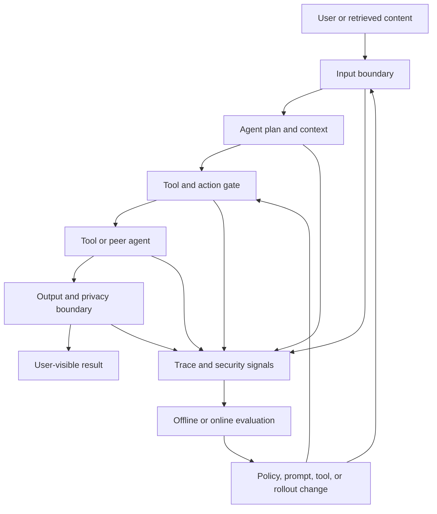

# Agent Security, Observability, and Evaluation

Agent security is an operating discipline, not a prompt-writing feature. An agent can read untrusted content, retain it, communicate with other agents, and invoke tools using meaningful authority. The useful operational model is therefore:

1. **Threat** — what can be subverted or fail.
2. **Control** — what limits authority, validates data, or requires a decision.
3. **Signal** — what makes the threat or control outcome visible.
4. **Action** — what an operator, evaluator, or system does next.

<!-- openwiki: broken internal link [../ai-engineering/security/security.md] file "../ai-engineering/security/security.md" does not exist. Fix the href or restore the target, then delete this comment. -->
This page complements the [security threat catalogue](../ai-engineering/security/security.md), the [agent systems architecture](../architecture/agent-systems.md), and [reliability and learning](../software-engineering/reliability-and-learning.md). Risks describe failure modes; mitigations enforce a boundary; observability records what happened; evaluation tests whether the boundary works. They should not be treated as interchangeable.

## Operating control flow

*The control loop places policy boundaries around model behavior and feeds traces and evaluations back into operations.*

A control is only useful if its decision is attributable to a run and can be acted on. Conversely, a trace is not a security control: recording an unsafe tool call after it happens does not undo the call. Keep prevention, detection, and recovery separate when designing a runbook.

## Threats mapped to controls and signals

| Threat category | Primary control boundary | Signals worth retaining | Operational response |
|---|---|---|---|
<!-- openwiki: broken internal link [../ai-engineering/security/mitigations/guardrails.md] file "../ai-engineering/security/mitigations/guardrails.md" does not exist. Fix the href or restore the target, then delete this comment. -->
| **Goal hijack and indirect prompt injection**: retrieved pages, documents, emails, or tool results redirect the agent. | Treat retrieved text as data, not authority; apply input and topic/jailbreak checks; constrain plans and gate consequential actions with [guardrails](../ai-engineering/security/mitigations/guardrails.md). There is no complete fix for instruction-following failure. | Source and trust class of context, policy decisions, plan changes, blocked inputs, tool arguments, and the run trace. | Quarantine the source or run, review the prompt/context boundary, add a regression case, and tighten the affected policy or tool permission. |
| **Tool misuse and unexpected code execution**: an agent chains legitimate capabilities outside their intended use or runs attacker-influenced code. | Allow-list tools and argument schemas, least privilege, sandbox interpreters where available, rate and budget limits, and explicit approval for destructive actions. | Tool name, normalized arguments, caller identity, approval decision, execution result, latency, retries, and resource usage. | Stop or revoke the run, inspect the tool and arguments, rotate exposed credentials, and add a test for the exploit path. |
| **Identity and privilege abuse**: impersonation, token theft, or escalation. | Authenticate every agent and tool boundary; authorize each action for the current principal and scope rather than trusting the model's stated identity. | Principal, delegated scope, authorization result, token or session lineage, peer identity, and denied attempts. | Revoke credentials, isolate the principal or agent, investigate the access trail, and reduce the default scope. |
| **Memory and context poisoning**: malicious content persists and influences later turns. | Separate trusted instructions from user, retrieved, and memory content; validate and expire memory; require provenance before promoting content into durable state. | Memory writes and reads, provenance, age, trust label, retrieval rank, and the context presented to the model. | Remove or quarantine poisoned state, replay affected runs, and add persistence and cross-turn regression tests. |
| **Insecure inter-agent communication and cascading failure**: spoofed or tampered hand-offs, loops, bad outputs, or outages propagate. | Authenticate peers and messages, validate hand-off schemas, cap depth and retries, use timeouts and circuit breakers, and define an owner for each downstream action. | Correlation and parent-run IDs, sender and recipient, message validation, hop count, retry count, queue delay, timeout, and circuit state. | Stop the cascade, isolate the failing dependency, replay from a known-good boundary, and restore with bounded retries. |
| **Supply-chain compromise and rogue agents**: a tool, MCP server, model, dependency, or unregistered agent operates outside governance. | Inventory and approve components, pin and review versions, authenticate MCP/tool endpoints, register agents, and deny unrecognized identities from the control plane. | Component and version, provenance, registration status, configuration drift, endpoint identity, and unexpected capability use. | Disable the component or agent, preserve evidence, compare against the approved inventory, and roll back or replace it. |
| **Human-agent trust exploitation**: people are manipulated or over-trust fluent but wrong output. | Show uncertainty and provenance, require human review for high-impact actions, make approvals specific, and avoid presenting model output as verified fact. | Approval actor and reason, displayed sources, confidence or evaluator signals, override rate, and downstream corrections. | Pause the workflow, notify affected reviewers, correct the record, and evaluate whether UI or approval policy encouraged unsafe trust. |
<!-- openwiki: broken internal link [../ai-engineering/security/mitigations/pii-masking.md] file "../ai-engineering/security/mitigations/pii-masking.md" does not exist. Fix the href or restore the target, then delete this comment. -->
| **PII and sensitive-data exposure** across prompts, outputs, traces, or third parties. | Apply [PII masking and anonymization](../ai-engineering/security/mitigations/pii-masking.md) at the data boundary; redact, pseudonymize, or reversibly tokenize before model, log, or third-party transmission. | Masking decision and detector version, data class, destination, retention class, and access audit. | Stop propagation, restrict access, assess disclosure, rotate tokens if needed, and preserve only the minimum evidence required for investigation. |

<!-- openwiki: broken internal link [../ai-engineering/security/security.md] file "../ai-engineering/security/security.md" does not exist. Fix the href or restore the target, then delete this comment. -->
The [security overview](../ai-engineering/security/security.md) describes this posture as zero trust: every agent action is authenticated, authorized, least-privileged, and logged. Logging must still respect the privacy boundary; a complete raw prompt dump is not a safe default.

## Telemetry and trace contract

Trace one logical run across model calls, guardrail decisions, memory operations, tool calls, approvals, and peer-agent hand-offs. At minimum, preserve:

- a correlation or run identifier and parent-child relationships;
- agent, version, model, tool, endpoint, and principal identity;
- input and output references, with sensitive values masked or tokenized;
- policy and authorization decisions, including the rule or control version;
- tool arguments and results at an appropriate redaction level;
- timing, retries, timeouts, token or cost budgets, and termination reason; and
- evaluator results, human overrides, and links to the incident or change that followed.

<!-- openwiki: broken internal link [../ai-engineering/observability/langsmith.md] file "../ai-engineering/observability/langsmith.md" does not exist. Fix the href or restore the target, then delete this comment. -->
<!-- openwiki: broken internal link [../ai-engineering/observability/langfuse.md] file "../ai-engineering/observability/langfuse.md" does not exist. Fix the href or restore the target, then delete this comment. -->
The contract should make a run reconstructable without making secrets or personal data broadly visible. Retention, access, and sampling are security decisions. A trace backend can be managed or self-hosted: [LangSmith](../ai-engineering/observability/langsmith.md) is described as a managed tracing, monitoring, and evaluation platform, while [Langfuse](../ai-engineering/observability/langfuse.md) is an open-source, self-hostable, OpenTelemetry-friendly alternative. The backend choice does not replace the event contract or the gateway controls.

## Evaluation as a feedback loop

Evaluation turns telemetry into evidence about whether controls hold under representative and adversarial behavior. Build datasets from normal tasks, blocked attempts, tool misuse, injection variants, poisoned-memory cases, permission denials, failure cascades, and human corrections. Keep expected outcomes explicit: success is not merely a fluent answer, but a safe decision, an appropriate refusal, or a correctly gated action.

<!-- openwiki: broken internal link [../ai-engineering/observability/langsmith-evals.md] file "../ai-engineering/observability/langsmith-evals.md" does not exist. Fix the href or restore the target, then delete this comment. -->
[LangSmith Evals](../ai-engineering/observability/langsmith-evals.md) describes dataset runs, LLM-as-judge evaluators, custom evaluators, and experiments over traces. Use deterministic checks for authorization, schema, PII, and tool-policy invariants; use model-based or human review for semantic quality and trust signals; and compare experiments against a baseline before rollout. Online evaluation can sample production traces, but it must inherit the same masking and access restrictions as operational telemetry.

A practical loop is:

1. Detect a signal or receive a report.
2. Correlate it to the complete run and affected component without exposing unnecessary data.
3. Contain the run, credential, tool, agent, or source when impact is plausible.
4. Reproduce the behavior in a controlled dataset and classify the failure as prevention, detection, or recovery.
5. Change the narrowest effective policy, permission, prompt, tool, component, or interface.
6. Re-run focused regressions and representative evaluations, then monitor the rollout for recurrence.

Do not convert a passing evaluator into a security guarantee. Evaluators can miss novel injections, judge the wrong output, or encode the same bias as the system under test. Preserve disagreements, false positives, false negatives, and evidence gaps in the evaluation record.

## Operational invariants and focused tests

The following invariants are useful change gates:

- An untrusted input cannot directly authorize a tool or override a higher-priority policy.
- Every consequential action has an authenticated principal, an authorization decision, and a trace link.
- A denied or failed action does not silently become an approved retry or an unbounded cascade.
- Durable memory records provenance and can be expired or removed without corrupting unrelated state.
- Sensitive values are masked before crossing the configured model, logging, or third-party boundary.
- A registered component or agent has an owner, version, permitted capabilities, and a rollback or disable path.
- A human approval is attributable and specific to the action shown, not a blanket approval inferred from conversation.

Focused tests should exercise indirect injection in tool results, malformed and over-privileged tool arguments, expired or mismatched credentials, spoofed peer messages, retry storms and timeouts, poisoned memory across turns, unexpected component versions, PII in traces, and approval/UI deception. Assert both the user-visible result and the control telemetry: a blocked action with no usable audit signal is an operational failure, as is a detailed trace that follows an action that should have been blocked.
