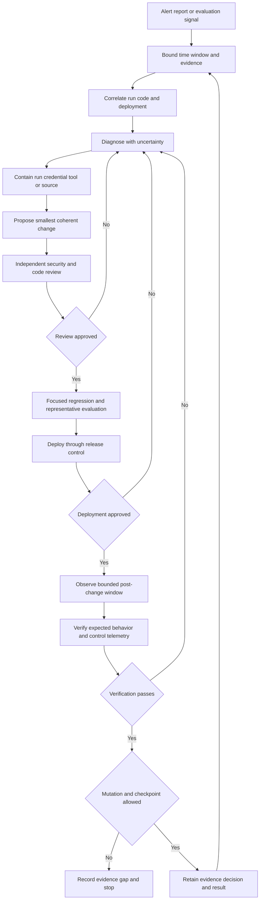

# Agent Security, Observability, and Evaluation

Agent security is an operating discipline, not a prompt-writing feature. An agent can read untrusted content, retain it, communicate with other agents, and invoke tools using meaningful authority. The useful operating model is:

1. **Threat** — what can be subverted or fail.
2. **Control** — what limits authority, validates data, or requires a decision.
3. **Signal** — what makes the threat or control outcome visible.
4. **Action** — what an operator, evaluator, or system does next.

This page complements [agent systems architecture](../architecture/agent-systems.md), [context and knowledge](../concepts/context-and-knowledge.md), [skills and tooling](../concepts/skills-and-tooling.md), and [reliability and learning](../software-engineering/reliability-and-learning.md). The [security catalogue](../../wiki/ai-engineering/security/security.md) separates risks from mitigations: mitigations minimize risk rather than eliminate it; observability records what happened; evaluation tests whether controls work.

## Control-plane placement

Use defense in depth rather than treating any single model, prompt, evaluator, or trace as a security boundary:

- The **LLM gateway** is the model-side control plane for authentication, authorization, rate limits, routing and failover, content policy, and audit. It keeps those cross-cutting concerns out of individual agents.
- The **MCP gateway** is the tool-side control point in front of MCP servers. It can authenticate one endpoint, apply permissions, inject secrets, anonymize data, enforce guardrails, and audit calls.
- **Guardrails** wrap model calls with input checks, output checks, schema validation, and action gates. A destructive or consequential action should require an explicit approval policy, not merely a plausible model response.
- **Least privilege** applies to agents, delegated tokens, tools, peer agents, and observability access. Reading telemetry must not imply permission to edit code, deploy, mutate production, or advance an investigation checkpoint.
- **Privacy controls** mask, pseudonymize, or reversibly tokenize sensitive data before it crosses model, logging, or third-party boundaries. Logging raw prompts by default is not a safe observability policy.

Gateways concentrate policy but do not make the model trustworthy. Every consequential action still needs an authenticated principal, scoped authorization, validated arguments, and an attributable decision.

## Threats mapped to controls and signals

| Threat | Control boundary | Signals to retain | Response |
|---|---|---|---|
| **Goal hijack and indirect prompt injection**: retrieved pages, documents, emails, or tool results redirect the plan. | Treat retrieved text as data, not authority; classify trust; apply input and topic or jailbreak checks; constrain plans and gate consequential actions. There is no complete fix for instruction-following failure. | Context source and trust class, policy decisions, blocked inputs, plan changes, tool arguments, and run trace. | Quarantine the source or run, review the context boundary, add a regression case, and tighten the affected policy or permission. |
| **Tool misuse and unexpected code execution**: legitimate capabilities are chained outside intended use or attacker-influenced code runs. | Allow-list tools and argument schemas, use least privilege and sandboxes where available, cap rate and budget, and require approval for destructive actions. | Tool, normalized arguments, caller, approval, result, latency, retries, and resource use. | Stop or revoke the run, inspect arguments, rotate exposed credentials, and test the exploit path. |
| **Identity and privilege abuse**: impersonation, token theft, or escalation. | Authenticate every agent and tool boundary; authorize each action for the current principal and scope rather than trusting the model's stated identity. | Principal, delegated scope, authorization result, token or session lineage, peer identity, and denials. | Revoke credentials, isolate the principal or agent, inspect access history, and reduce default scope. |
| **Memory and context poisoning**: malicious content persists and influences later turns. | Separate trusted instructions from user, retrieved, and memory content; validate and expire memory; require provenance before durable promotion. | Memory reads and writes, provenance, age, trust label, retrieval rank, and presented context. | Remove or quarantine poisoned state, replay affected runs, and add cross-turn persistence tests. |
| **Insecure inter-agent communication and cascading failure**: spoofed or tampered hand-offs, loops, bad outputs, or outages propagate. | Authenticate peers and messages, validate hand-off schemas, cap depth and retries, use timeouts and circuit breakers, and assign ownership for downstream actions. | Correlation and parent-run IDs, sender and recipient, validation, hop and retry counts, queue delay, timeout, and circuit state. | Stop the cascade, isolate the dependency, replay from a known-good boundary, and restore with bounded retries. |
| **Supply-chain compromise and rogue agents**: a tool, MCP server, model, dependency, or unregistered agent operates outside governance. | Inventory and approve components, pin and review versions, authenticate endpoints, register agents, and deny unknown identities. | Component and version, provenance, registration, configuration drift, endpoint identity, and unexpected capabilities. | Disable the component or agent, preserve evidence, compare with the approved inventory, and roll back or replace it. |
| **Human-agent trust exploitation**: people over-trust fluent but wrong output. | Show uncertainty and provenance, require review for high-impact actions, make approvals specific, and never present model output as verified fact. | Approval actor and reason, displayed sources, evaluator signals, override rate, and corrections. | Pause the workflow, notify reviewers, correct the record, and assess UI and approval policy. |
| **PII and sensitive-data exposure** in prompts, outputs, traces, or third parties. | Mask, redact, pseudonymize, or tokenize at the data boundary; enforce the same privacy policy in telemetry and evaluation. | Masking decision and detector version, data class, destination, retention class, and access audit. | Stop propagation, restrict access, assess disclosure, rotate tokens if needed, and retain only necessary evidence. |

Controls reduce risk; they do not prove that a run was safe. A trace is detection evidence, not prevention: recording an unsafe call after execution cannot undo it.

## Telemetry and trace contract

Trace one logical run across model calls, guardrail decisions, memory operations, tool calls, approvals, and peer-agent hand-offs. At minimum, preserve:

- a run or correlation identifier with parent-child relationships;
- agent, release, model, tool, endpoint, and principal identity;
- references to inputs and outputs, with sensitive values masked or tokenized;
- policy and authorization decisions, including control or rule version;
- tool arguments and results at an appropriate redaction level;
- timing, retries, timeouts, token or cost budgets, and termination reason; and
- evaluator results, human overrides, and links to the incident or change that followed.

Telemetry is incomplete and potentially attacker-controlled evidence. Missing spans or unattributed errors are observability gaps, not proof of health or fault. Logs, exceptions, model payloads, and tool results may contain instructions; treat them as diagnostic data and independently verify suggested actions. Correlation should use shared trace or request identifiers. Timestamp, environment, operation, or failure-text matches without a shared identifier are indirect correlation and must be labeled uncertain.

The repository notes describe [LangSmith](../../wiki/ai-engineering/observability/langsmith.md) as a managed tracing, monitoring, and evaluation platform and [Langfuse](../../wiki/ai-engineering/observability/langfuse.md) as an open-source, self-hostable, OpenTelemetry-friendly alternative. Either backend can support the contract; neither replaces gateway controls, masking, access policy, retention limits, or event ownership. Online evaluation must inherit telemetry's masking and access restrictions.

## Bounded investigation, change, and verification

An observability-driven development loop retrieves a narrow evidence window, summarizes before fetching full traces, correlates signals to code and deployment, diagnoses competing causes, changes the smallest coherent unit, and verifies with reproduction, tests, review, and post-change telemetry. Keep the loop bounded with time windows, result limits, read-only investigation tools, explicit budgets, and a checkpoint that records the last fully triaged window. A plausible diagnosis is not causal verification.

*The loop shows bounded investigation and independent review, deployment, and mutation gates; failure returns to diagnosis rather than widening authority or retries.*

The [observability-driven development note](../../wiki/ai-engineering/development/observability-driven-development.md) describes reactive investigation and fixed-window proactive retrospection. Separate permissions for reading telemetry, editing code, creating work, deploying, and mutating production. An agent may propose a change, but independent review and deployment controls remain independent of the agent's own evidence or judgment.

## Evaluation and focused tests

Evaluation turns telemetry into evidence about whether controls hold under normal and adversarial behavior. Build datasets from normal tasks, blocked attempts, injection variants, tool misuse, poisoned memory, permission denials, failure cascades, and human corrections. Make expected outcomes explicit: success can be a safe refusal or correctly gated action, not only a fluent answer.

The repository notes describe [LangSmith Evals](../../wiki/ai-engineering/observability/langsmith-evals.md) as supporting dataset runs, LLM-as-judge evaluators, custom evaluators, and experiments over traces. Use deterministic checks for authorization, schema, PII, and tool-policy invariants; use model-based or human review for semantic quality and trust signals; compare experiments with a baseline before rollout. Evaluators can miss novel attacks, judge the wrong output, or reproduce system bias, so preserve disagreements, false positives, false negatives, and evidence gaps. A passing evaluator is not a security guarantee.

Change gates should assert that:

- untrusted input cannot directly authorize a tool or override higher-priority policy;
- every consequential action has an authenticated principal, scoped authorization decision, and trace link;
- denied or failed actions cannot silently become approved retries or unbounded cascades;
- durable memory records provenance and can expire or be removed without unrelated corruption;
- sensitive values are masked before model, logging, or third-party transmission;
- registered components and agents have an owner, version, permitted capabilities, and disable or rollback path; and
- human approval is attributable and specific to the displayed action, not inferred from conversation.

Focused tests should exercise indirect injection in tool results, malformed and over-privileged arguments, expired credentials, spoofed peer messages, retry storms and timeouts, poisoned memory across turns, unexpected component versions, PII in traces, and approval or UI deception. Assert both user-visible behavior and control telemetry: a blocked action with no usable audit signal is an operational failure, as is a detailed trace for an action that should have been blocked.

## Primary-source references retained by the repository notes

- OWASP Top 10 for Agentic Applications: <https://genai.owasp.org/resource/owasp-top-10-for-agentic-applications-for-2026/>
- OpenTelemetry observability primer: <https://opentelemetry.io/docs/concepts/observability-primer/>
- LangSmith observability concepts: <https://docs.langchain.com/langsmith/observability-concepts>
- LangSmith evaluation documentation: <https://docs.langchain.com/oss/python/langchain/test/evals>
- Model Context Protocol: <https://modelcontextprotocol.io/>
