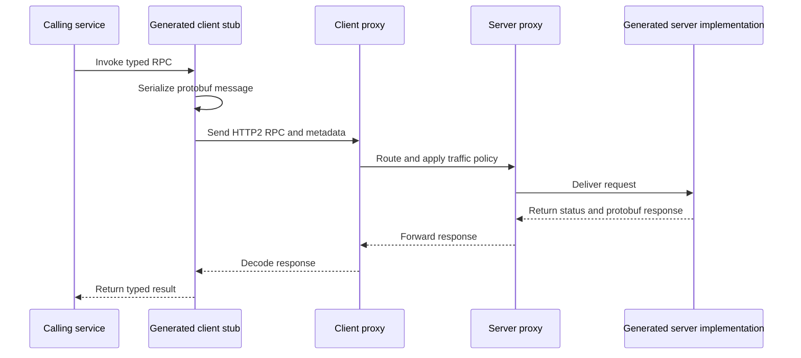
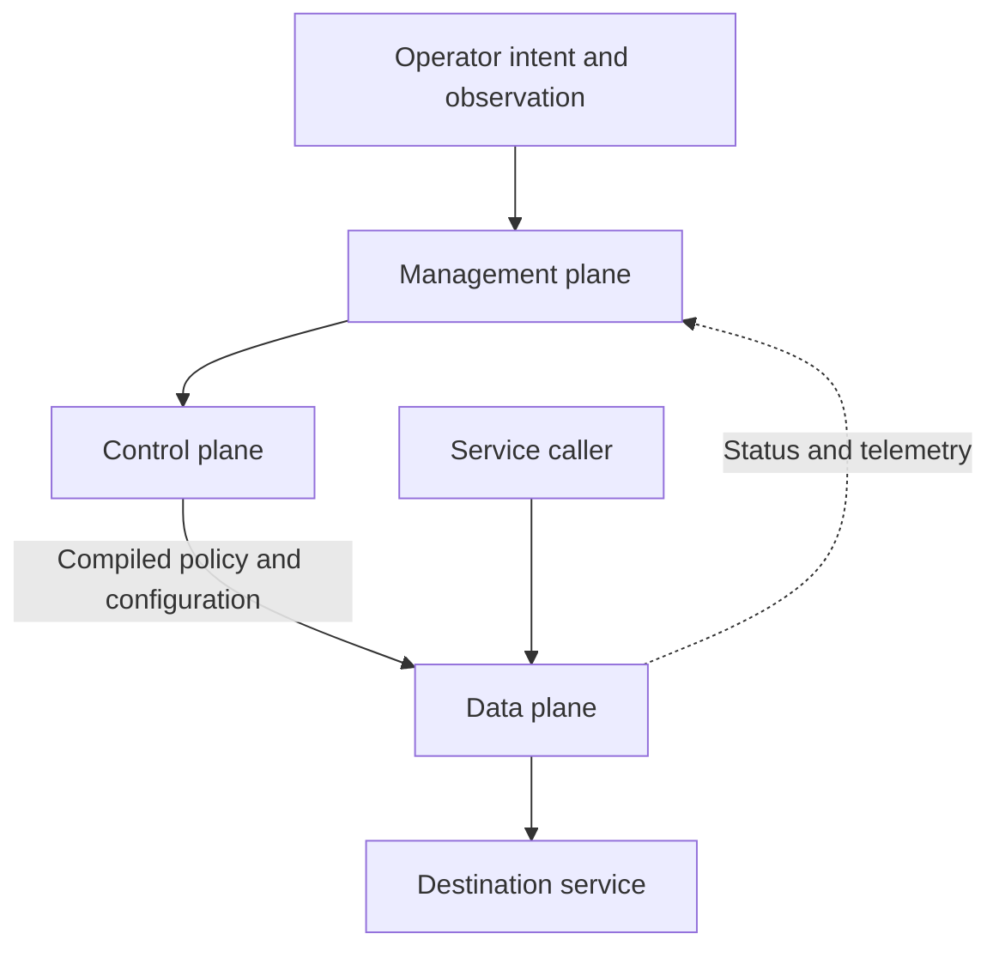

# Distributed Communication and Service Infrastructure

Distributed services have two related but distinct concerns: **what messages and
operations mean** at an interface boundary, and **how traffic is delivered and
<!-- openwiki: broken internal link [communication/protobuf.md] file "communication/protobuf.md" does not exist. Fix the href or restore the target, then delete this comment. -->
operated** after it crosses that boundary. [Protocol Buffers](communication/protobuf.md)
<!-- openwiki: broken internal link [communication/grpc.md] file "communication/grpc.md" does not exist. Fix the href or restore the target, then delete this comment. -->
provide the schema and wire representation; [gRPC](communication/grpc.md) turns a
<!-- openwiki: broken internal link [infrastructure/service-mesh.md] file "infrastructure/service-mesh.md" does not exist. Fix the href or restore the target, then delete this comment. -->
schema into a typed RPC contract and streaming transport; a [service mesh](infrastructure/service-mesh.md)
adds infrastructure-level routing, security, reliability, and telemetry. The
<!-- openwiki: broken internal link [infrastructure/planes.md] file "infrastructure/planes.md" does not exist. Fix the href or restore the target, then delete this comment. -->
[control/data/management plane](infrastructure/planes.md) distinction explains who
decides policy, who carries requests, and who exposes operator intent.

## The contract and request path

A `.proto` file is the source contract. It can declare both protobuf messages and
gRPC services, including method request and response types. `protoc` generates
language bindings, serializers, parsers, client stubs, and server interfaces at
build time. The application therefore calls a generated stub and implements a
generated service boundary rather than hand-writing an untyped wire protocol.

Protobuf field numbers are wire identifiers and must never be reused. Unknown
fields can be ignored by older readers, while newer readers use defaults for
absent fields; this enables compatible, independently deployed producers and
consumers. The payload is not self-describing, however: consumers need the `.proto`
(or generated bindings) to interpret it. A schema registry, shared repository, or
build dependency is consequently part of the delivery system, not optional
convenience. Also, serialized protobuf bytes are not a canonical message identity:
the same logical message may have multiple valid encodings, so bytes must not be
used as an equality, hash, or signature surrogate.

*The request path separates application contract and serialization from proxy traffic handling.*

### gRPC interaction model

gRPC uses HTTP/2 and supports four call shapes:

| Shape | Interaction | Appropriate mental model |
| --- | --- | --- |
| Unary | One request, one response | A remote function call |
| Server streaming | One request, many responses | A subscription or result stream |
| Client streaming | Many requests, one response | An upload or aggregation |
| Bidirectional streaming | Independent streams in both directions | A long-lived interactive session |

Deadlines bound how long a caller waits and surface expiry as `DEADLINE_EXCEEDED`;
cancellation can end an RPC from either side. Metadata carries call context such
as authentication tokens, channels carry connection configuration such as
compression, and fixed gRPC status codes give cross-service failures a common
vocabulary. These are part of the operational contract, not merely transport
details.

Long-lived multiplexed HTTP/2 connections make connection-level balancing a poor
proxy for request-level distribution. A mesh or client-side policy must balance
individual gRPC requests where appropriate. gRPC is consequently a strong
service-to-service choice, but browsers generally need grpc-web and a proxy, and
binary traffic is less convenient for `curl`, generic log tooling, and casual
inspection than REST. Schema distribution and coordinated build/release workflows
are additional costs.

## Planes and the service-mesh boundary

A **data plane** carries application traffic and applies the rules it already has.
A **control plane** decides configuration and policy and distributes it to data-plane
components. A **management plane** is the operator-facing API, CLI, console, audit,
and monitoring surface that expresses and observes intent. Some architectures
collapse management into control, but keeping it explicit matters when operator
access and availability have separate requirements.

*Policy flows downward from management through control to traffic-carrying data components; traffic flows through the data plane.*

In Istio, Envoy sidecars (or ambient `ztunnel`) are data-plane components and
`istiod` is the control plane. In sidecar mode, Envoy intercepts pod traffic and
provides L7 controls. In ambient mode, the per-node L4 `ztunnel` handles identity
and encryption, while optional per-namespace waypoints add L7 policy. The mode
choice trades comprehensive per-workload behavior against lower overhead where
most workloads only need mTLS.

The key invariant is **fail-static behavior**: when the control plane is
unavailable, a healthy data plane should continue serving with its last known
configuration. A control-plane outage should primarily prevent policy changes,
not stop already-configured forwarding. This also implies separate capacity and
SLO thinking: data-plane resources scale with traffic, while control-plane
resources scale with configuration churn. Their security surfaces differ too:
the data plane sees user data, while control and management planes possess the
authority to redirect it.

## What the mesh owns—and what it does not

A service mesh moves shared service-to-service concerns out of application code
and into colocated or node-level proxies. It can apply routing, load balancing,
retries, failover, fault injection, mTLS, identity-based authorization, and
metrics, logs, and traces consistently across languages and even services whose
source is unavailable. It does not replace the protobuf schema, generated gRPC
contract, application authorization semantics, or business-level retry safety.
Those remain application and interface responsibilities.

The mesh is an additional distributed system: proxy hops add latency, its control
plane must be upgraded and debugged, and failures introduce another diagnostic
layer. Adopt it when the number of services, languages, traffic policies, or
compliance requirements makes per-service libraries more expensive than the mesh.
For lower-level or external interfaces, REST may still be preferable for browser
compatibility and inspectability; for internal typed streaming, gRPC plus a
request-aware mesh can align well.

## Operational checklist

- Version `.proto` definitions as compatibility-critical artifacts; reserve or
  retire field numbers rather than reusing them, and make generated-code updates
  part of the consumer release process.
- Set deadlines at call boundaries and propagate cancellation. Treat retries as a
  policy requiring idempotency and explicit ownership, not as a universal fix for
  timeouts.
- Ensure request-level balancing for long-lived HTTP/2/gRPC connections, and make
  proxy-generated telemetry useful without assuming it exposes protobuf payloads.
- Test data-plane behavior during control-plane loss: verify last-known policy,
  serving continuity, and the intended security posture.
- Give control and management access stronger protection and separate budgets from
  high-volume data traffic; they can redirect traffic even when they do not carry
  the user payload.

## Further reading

- [gRPC core concepts](https://grpc.io/docs/what-is-grpc/core-concepts/) and [status codes](https://grpc.io/docs/guides/status-codes/)
- [Protocol Buffers overview](https://protobuf.dev/overview/) and [wire encoding](https://protobuf.dev/programming-guides/encoding/)
- [Istio overview](https://istio.io/latest/docs/overview/what-is-istio/) and [ambient mode](https://istio.io/latest/docs/ambient/overview/)
- [Models and protocols](../integrations/models-and-protocols.md), [security and observability](../operations/security-and-observability.md), and [reliability and learning](reliability-and-learning.md)
