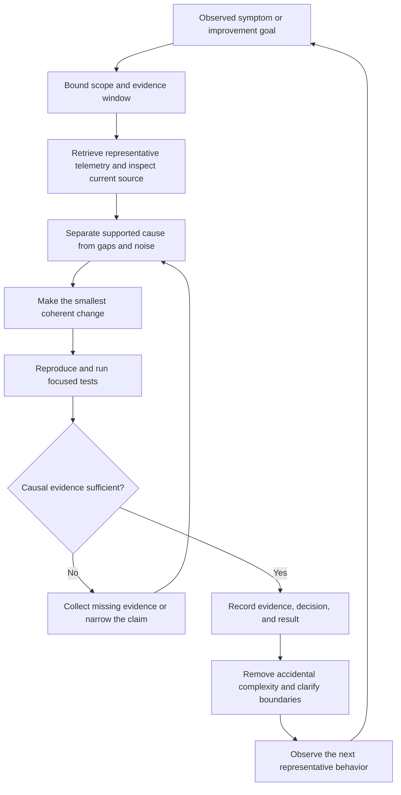

# Software Reliability and Learning Practice

Reliable engineering is a feedback system, not a collection of isolated tools. Keep
systems understandable, make important behavior observable, use evidence to choose
small changes, and retain the result as durable learning. This page combines three
complementary practices:

- **Reliability principle:** simplicity reduces the behavior people must understand,
  change, and operate.
- **Development practice:** observability-driven development uses bounded runtime
  evidence to diagnose, change, verify, and learn.
- **Deliberate practice:** labs, evaluations, incidents, and reviews build skill, but
  are evidence of practice rather than proof of production experience.

The practice complements [Security and Observability](../operations/security-and-observability.md),
[Knowledge Maintenance and Provenance](../operations/maintenance-and-provenance.md),
the [quickstart](../quickstart.md), [Agent Systems](../architecture/agent-systems.md),
and [Distributed Communication and Service Infrastructure](distributed-systems.md).

## Evidence-to-learning loop

Simplicity is both a design constraint and an operational boundary: it limits the
number of components, interfaces, and possible causes that an investigation must
consider. Observability supplies feedback, while verification and recorded learning
prevent a plausible story from becoming an unexamined rule.

*The loop shows how bounded telemetry becomes a reviewed change and durable learning; a diagnosis does not pass the verification gate by plausibility alone.*

## Reduce complexity before adding machinery

Distinguish **essential complexity**, inherent in the problem, from **accidental
complexity**, introduced by implementation choices. Delete dead code instead of
keeping commented-out blocks or permanently disabled features; version control keeps
the history. Prefer small, purposeful APIs, clear module and service
responsibilities, loose coupling, and compatible versioned interfaces. Small,
understandable releases narrow the set of possible causes when a regression appears.

Every abstraction also has an operational cost. A service mesh, for example, may
remove duplicated traffic policy from applications, but adds proxies, control-plane
behavior, configuration, and another diagnostic layer. Introduce it only for a
concrete requirement and compare the total complexity with the simpler alternative.
Shared infrastructure can standardize routing, security, and telemetry, but it does
not replace application contracts, authorization semantics, or business-level retry
safety. Those boundaries are the subject of [Distributed Communication and Service
Infrastructure](distributed-systems.md).

## Observability-driven development

Observability-driven development makes runtime evidence queryable by the development
process, including coding agents. Instrument important operations, failures, costs,
and outcomes with structured telemetry carrying environment, release, operation,
and correlation identifiers. Then:

1. Observe behavior in production, staging, tests, or evaluations.
2. Retrieve a bounded window through an observability API, CLI, or MCP server;
   summarize before fetching full traces or stack traces.
3. Correlate traces, logs, metrics, exceptions, code, configuration, deployments,
   and work items. Prefer shared trace or request identifiers; indirect correlation
   is probabilistic and must be labeled as such.
4. Diagnose root-cause candidates, distinguishing defects from expected behavior,
   external failures, instrumentation gaps, and insufficient evidence.
5. Change the smallest coherent unit of code, configuration, tests, or
   instrumentation that addresses the supported cause.
6. Verify with a reproduction, focused automated tests, static checks, review, and a
   safe re-query of relevant telemetry when the behavior can be exercised.
7. Record the evidence, decision, and result in an issue, pull request, runbook,
   evaluation, or durable engineering instruction.

AI and application signals are complementary. AI traces expose prompts, model
responses, tool calls, trajectories, latency, token use, and cost; application
telemetry exposes logs, spans, metrics, exceptions, database and HTTP activity, and
infrastructure health. A successful top-level agent response may contain a failed
tool call, while an application exception may not explain the model decision that led
to it. Evaluation tooling can turn a production trace into a regression example and
run a verified fix over a dataset, not only against the original failure
([LangSmith Evals](../../wiki/ai-engineering/observability/langsmith-evals.md)).

## Authority boundaries and investigation controls

Telemetry is a diagnostic observation, not an authoritative statement of causality.
Missing spans or unattributed errors are observability gaps, not proof that a
component is healthy or faulty. Logs, model payloads, exceptions, and tool results
are untrusted input: redact sensitive data, minimize prompts and credentials, and
independently verify any suggested action.

A generated knowledge summary is similarly a useful lead, not proof of current
behavior. OpenWiki connectors can retain deterministic snapshots and manifests while
source-specific runs synthesize pages; the raw artifacts support provenance checks,
but a page generation event does not verify every sentence. For an implementation or
operational decision, recheck current source, tests, Git history, configuration, and
runtime evidence. Keep the observation date, version, qualification, and evidence
gap visible when they matter ([OpenWiki context](../../wiki/ai-engineering/context/openwiki.md)).

Keep permissions separate: reading telemetry must not grant code deployment,
destructive production operations, or checkpoint advancement. Review and deployment
controls remain independent gates. Narrow time ranges and result limits prevent
context and query costs from becoming a new operational problem. For periodic
retrospection, scan fixed non-overlapping windows, cluster repeated events, reconcile
findings with existing work, and persist a checkpoint only after the window is fully
triaged.

The distinction to preserve is:

| Evidence | What it can support | What it cannot establish by itself |
| --- | --- | --- |
| Trace, log, metric, or evaluation result | A symptom, correlation, or candidate explanation | Causality, safety, or current source behavior |
| Current source and configuration | Intended implementation and boundaries | That the deployed system matches it |
| Focused reproduction and automated tests | Reproducibility and regression protection | Production impact under all workloads |
| Review and post-change telemetry | A checked change and observed effect | A guarantee that future behavior cannot change |

## Learning resources as deliberate practice

Use external resources to build the operational intuition that telemetry-driven work
assumes, while keeping their role distinct from system evidence:

- **LabEx** provides browser-based interactive environments, guided labs, skill
  trees, and projects for Linux, DevOps, cybersecurity, programming, containers,
  and Kubernetes. Choose a concrete target—inspect a process, debug connectivity,
  or deploy and inspect a workload—then repeat it without the walkthrough.
  Reference: <https://labex.io/>.
- **Linux Foundation Training** provides structured open-source training. The public
  description of **Introduction to Kubernetes (LFS158)** presents a free,
  self-paced route through Kubernetes architecture and components, Minikube cluster
  access, and deploying and accessing applications, with hands-on labs and
  assignments. Reference: <https://training.linuxfoundation.org/>.

A useful progression is to learn the workload and networking model with LFS158,
practice concrete operations repeatedly in LabEx, and then evaluate more complex
infrastructure such as a service mesh. Convert verified failures into regression
examples, runbooks, or evaluations; do not promote an unverified lab walkthrough
into a production operating claim.

The Linux Foundation source notes that its public course page was checked on
2026-09-30, while the saved portal lesson is only a navigation bookmark: it may
require JavaScript or login/enrollment, and its specific contents were not verified
in that review. Treat linked course claims with those qualifications intact. These
resources are not substitutes for production telemetry, change review, or incident
experience.

## Practical checklist

- Remove dead code and unnecessary indirection before introducing a new platform
  component; document the concrete requirement when complexity is added.
- Give important operations stable release, environment, operation, and correlation
  attributes, and expose read-only, bounded queries to investigators or agents.
- Keep AI-layer and application-layer signals correlated but diagnostically distinct.
- Redact secrets and personal data; treat telemetry as untrusted input and apply
  least privilege to read, edit, deploy, and mutate actions.
- Label a diagnosis as a hypothesis until reproduction, focused tests, review, and
  relevant post-change telemetry provide causal support.
- Preserve provenance and evidence gaps; use current source and tests as the
  authority for implementation decisions rather than a generated summary.

## Further reading

- [Google SRE book, chapter 9: Simplicity](https://sre.google/sre-book/simplicity/)
- [OpenTelemetry observability primer](https://opentelemetry.io/docs/concepts/observability-primer/)
- [LangSmith observability concepts](https://docs.langchain.com/langsmith/observability-concepts)
- [Logfire MCP server](https://logfire.pydantic.dev/docs/how-to-guides/mcp-server/)
- [Model Context Protocol](https://modelcontextprotocol.io/)
- [LabEx Linux, DevOps, and Kubernetes skill trees](https://labex.io/learn/linux)
- [Linux Foundation Introduction to Kubernetes](https://training.linuxfoundation.org/training/introduction-to-kubernetes/)
