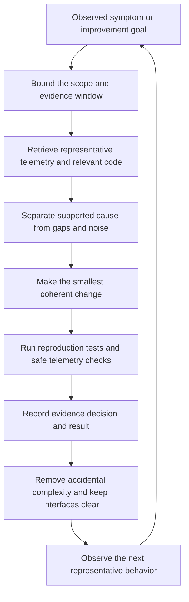

# Software Reliability and Learning Practice

Reliable engineering is a feedback system, not a collection of isolated tools. Keep
systems understandable, make important behavior observable, use evidence to choose
small changes, and retain the result as durable learning. This page combines three
different kinds of guidance:

- **Reliability principle:** simplicity reduces the amount of behavior people must
  understand, change, and operate.
- **Development practice:** observability-driven development uses bounded runtime
  evidence to diagnose, change, verify, and learn.
- **External learning resources:** LabEx and Linux Foundation Training provide
  practice environments and structured courses. Completing a lab is practice
evidence, not proof of production experience or certification readiness.

The practice complements [Security and Observability](../operations/security-and-observability.md),
the [quickstart](../quickstart.md), and [Distributed Communication and Service Infrastructure](distributed-systems.md).

## A reliability-and-learning loop

Simplicity is the design constraint; observability supplies feedback; learning makes
improvement repeatable. The loop should be narrow enough that a reviewer can explain
why the change is justified and how its effect will be checked.

*The loop connects runtime evidence to a bounded change and durable learning while simplicity limits the cost of each iteration.*

## Reduce complexity before adding machinery

Distinguish **essential complexity**, inherent in the problem, from **accidental
complexity**, introduced by implementation choices. Delete dead code instead of
keeping commented-out blocks or permanently disabled features; version control keeps
the history. Prefer small, purposeful APIs, clear module and service
responsibilities, loose coupling, and compatible versioned interfaces. Small,
understandable releases narrow the set of possible causes when a regression appears.

Every abstraction also has an operational cost. A service mesh, for example, may
remove duplicated traffic policy from applications, but adds proxies, control-plane
behavior, configuration, and another diagnostic layer. Introduce it only for a
concrete requirement and compare the total complexity with the simpler alternative.
This is the same boundary described in [Distributed Communication and Service
Infrastructure](distributed-systems.md): shared infrastructure can standardize
routing, security, and telemetry, but it does not replace application contracts,
authorization semantics, or business-level retry safety.

## Observability-driven development

Observability-driven development makes runtime evidence queryable by the development
process, including coding agents. Instrument important operations, failures, costs,
and outcomes with structured telemetry carrying environment, release, operation,
and correlation identifiers. Then:

1. Observe behavior in production, staging, tests, or evaluations.
2. Retrieve a bounded window through an observability API, CLI, or MCP server;
   summarize before fetching full traces or stack traces.
3. Correlate traces, logs, metrics, exceptions, code, configuration, deployments,
   and work items. Prefer shared trace or request identifiers; indirect correlation
   is probabilistic and must be labeled as such.
4. Diagnose root-cause candidates, distinguishing defects from expected behavior,
   external failures, instrumentation gaps, and insufficient evidence.
5. Change the smallest coherent unit of code, configuration, tests, or
   instrumentation that addresses the supported cause.
6. Verify with reproduction, automated tests, static checks, and a safe re-query of
   relevant telemetry when the behavior can be exercised.
7. Record the evidence, decision, and result in an issue, pull request, runbook,
   evaluation, or durable engineering instruction.

AI-specific traces explain prompts, model responses, tool calls, trajectories,
latency, token use, and cost. Application telemetry explains logs, spans, metrics,
exceptions, database and HTTP activity, and infrastructure health. Neither replaces
the other: a successful top-level agent response may contain a failed tool call, and
an application exception may not explain the model decision that led to it. Outcome
evaluations can turn a production trace into a regression example and test a fix
against a dataset rather than only the originally observed failure.

### Controls and failure modes

Telemetry is incomplete evidence. Missing spans or unattributed errors are
observability gaps, not proof that a component is healthy or faulty. Logs, model
payloads, exceptions, and tool results are also untrusted diagnostic input: redact
sensitive data, minimize prompts and credentials, and independently verify suggested
actions. Narrow time ranges and result limits prevent context and query costs from
becoming a new operational problem.

Keep permissions separate: reading telemetry must not grant code deployment,
destructive production operations, or checkpoint advancement. Review and deployment
controls remain independent gates; a plausible diagnosis is not verification. For
periodic retrospection, scan fixed non-overlapping windows and persist a checkpoint
only after the window is fully triaged, clustering repeated events and reconciling
findings with existing work.

## Learning resources as deliberate practice

Use external resources to build the operational intuition that telemetry-driven work
assumes, while keeping their role distinct from system evidence:

- **LabEx** provides browser-based interactive environments, guided labs, skill
  trees, and projects for Linux, DevOps, cybersecurity, programming, containers,
  and Kubernetes. Choose a concrete target—inspect a process, debug connectivity,
  or deploy and inspect a workload—then repeat it without the walkthrough. Reference:
  <https://labex.io/>.
- **Linux Foundation Training** provides structured open-source training. Its public
  description of **Introduction to Kubernetes (LFS158)** presents a free,
  self-paced route through Kubernetes architecture and components, Minikube cluster
  access, and deploying and accessing applications, with hands-on labs and
  assignments. Reference: <https://training.linuxfoundation.org/>.

A useful progression is to learn the underlying workload and networking model with
LFS158, practice concrete operations repeatedly in LabEx, and then evaluate more
complex infrastructure such as a service mesh. These resources are not substitutes
for production telemetry, change review, or incident experience.

The Linux Foundation source notes that its public course page was checked on
2026-09-30, while the saved portal lesson is only a navigation bookmark: it may
require JavaScript or login/enrollment, and its specific contents were not verified
in that review. Treat linked course claims with those qualifications intact. The
resource descriptions above likewise summarize the source notes; they do not imply
that the linked providers or course contents were independently verified here.

## Practical checklist

- Remove dead code and unnecessary indirection before introducing a new platform
  component; document the concrete requirement when complexity is added.
- Give important operations stable release, environment, operation, and correlation
  attributes, and expose read-only, bounded queries to investigators or agents.
- Keep AI-layer and application-layer signals correlated but diagnostically distinct.
- Redact secrets and personal data; treat telemetry as untrusted input and apply
  least privilege to read, edit, deploy, and mutate actions.
- Prefer small releases, representative reproductions, targeted tests, review, and
  post-change telemetry over confidence based on a plausible explanation.
- Convert verified failures into regression examples, runbooks, or evaluations; do
  not promote an unverified lab walkthrough into a production operating claim.

## Source notes and further reading

Principle: [Google SRE book, chapter 9: Simplicity](https://sre.google/sre-book/simplicity/).

Development practice: [OpenTelemetry observability primer](https://opentelemetry.io/docs/concepts/observability-primer/),
[LangSmith observability concepts](https://docs.langchain.com/langsmith/observability-concepts),
[Logfire MCP server](https://logfire.pydantic.dev/docs/how-to-guides/mcp-server/), and
[Model Context Protocol](https://modelcontextprotocol.io/).

Learning resources: [LabEx Linux skill tree](https://labex.io/learn/linux),
[LabEx DevOps skill tree](https://labex.io/learn/devops),
[LabEx Kubernetes skill tree](https://labex.io/learn/kubernetes),
[Linux Foundation Introduction to Kubernetes](https://training.linuxfoundation.org/training/introduction-to-kubernetes/),
and its [course portal](https://trainingportal.linuxfoundation.org/learn/course/introduction-to-kubernetes).
